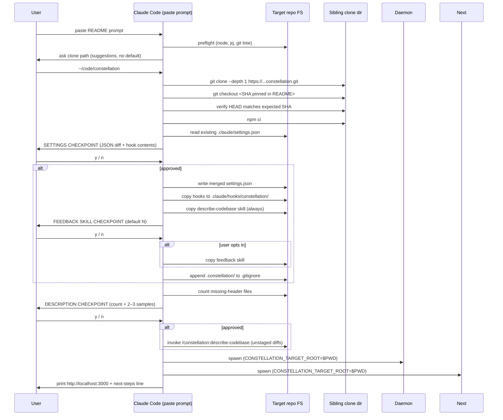

# AI-driven onboarding flow for Constellation

## Overview

Ship the four pieces that turn Constellation from a personal repo into something a stranger can actually use against their own codebase, without leaving Claude Code:

1. A scan-path refactor that lets one Constellation install visualize a *different* directory (the sibling-clone substrate; folded into this plan as Phase 0).
2. A copy-pasteable Claude Code prompt in the README that orchestrates clone + install + hooks + skills + dev server.
3. `/constellation:describe-codebase` — a one-shot batch writer that fills in the leading-comment headers Constellation extracts as tile descriptions.
4. `/constellation:feedback` — a **public-variant** skill (per planning review) that lets any user file a labeled issue against this repo. Privacy-redacted, single-confirmation, no transcripts.

The plan also captures the three security/integrity decisions document-review surfaced (clone integrity, hook-script privilege display, settings.json merge algorithm) and an end-to-end smoke-test gate before merge.

## Problem Frame

Today, the only path to using Constellation against another repo is the manual ritual: read the README, `git clone`, `npm install`, copy hooks into `.claude/`, hand-edit `.claude/settings.json`, install `jq`, and accept that the visualizer will look text-blank because the target's files have no leading-comment headers. Even if the user gets it working, there's no way to tell us when it breaks.

The artifacts above collapse the ritual into one paste, with two checkpoints (settings diff, description count) and clean recovery if either is declined. A successful run lands the user at `localhost:3000` looking at their own codebase with hover descriptions populated, in roughly five minutes (description pass excluded).

(See origin: `docs/brainstorms/ai-onboarding-flow-requirements.md`.)

## Requirements Trace

Carried forward from origin doc, with the F-section rescoped per planning review and grouped by concern:

**Onboarding orchestration**

- **R1.** Single copy-pasteable prompt in README delivers full install (origin P1, P2).
- **R2.** Preflight checks Node, `jq`, git working tree before any mutation; exits clean on missing deps (P3).
- **R8.** Dev server starts pointed at the target repo and prints localhost URL + one-line next steps (P9).
- **R11.** Re-running the prompt in the same repo is safe: detects existing clone, hooks, skills and offers update-or-skip (origin Success Criteria).

**Clone & install integrity**

- **R3.** Sibling-clone install: agent asks where to clone with plausible suggestions, no built-in default, never silently overwrites (P4).
- **R4.** `npm install` runs in the clone dir using **`npm ci`** against a **pinned commit SHA** referenced in the README; integrity comes from the lockfile + the SHA pin, not from gpg verification (P5 + new clone-integrity decision).

**Configuration & hooks**

- **R5.** Settings.json mutation is gated by an explicit diff checkpoint that shows both JSON matchers **and hook-script contents** so the user can audit privilege scope before approving (P6 + new privilege-display decision).
- **R6.** Hooks install under `.claude/hooks/constellation/` (sub-namespaced) to avoid collision; skills install under `.claude/skills/constellation/` (P7).
- **R12.** Constellation can be pointed at any target repo via env or flag, with clean separation between *install root* (where Constellation's code lives) and *target root* (the repo being visualized) — folded in from origin Prerequisites.

**Code descriptions**

- **R7.** Description checkpoint shows count of files lacking headers + 2–3 representative samples; user can decline without breaking install (P8).
- **R9.** `/constellation:describe-codebase` enumerates supported file types, generates intent-focused 1–2 sentence headers, never overwrites existing headers, leaves changes unstaged for user review, prints summary (D1–D6).

**Feedback channel**

- **R10.** `/constellation:feedback` (public-variant) accepts free-form description, auto-gathers redacted system context (basename only, never full path), shows draft and confirms before submitting via `gh issue create --label "via:dogfood"`, falls back to stdout dump on `gh` failure (F1–F5, public-scoped).

## Scope Boundaries

- One Constellation install per machine; one daemon at a time on `127.0.0.1:47317`.
- Description-writer skill targets only file types Constellation already extracts headers from (TS/JS/CSS/SH/MD). Other languages get blank tiles, same as today.
- No transcript content in feedback issues. Body is agent-gathered system context only.
- No published npm package. Sibling clone + supervisor is the install model.
- No cross-repo memory between Constellation installs.
- Description-writer leaves changes **unstaged** with no sentinel/skip-if-uncertain machinery; the writer prompt is responsible for either producing a confident description or omitting the file (per planning review).

### Deferred to Separate Tasks

- **Multi-target support** (multiple daemons, port allocation): future iteration.
- **Multi-language description extraction** (Python, Go, etc.): separate feature.
- **`npx constellation` distribution**: future, requires npm publishing.
- **Constellation update flow** beyond `git pull` in clone dir: separate plan if it grows complexity.

## Context & Research

### Relevant Code and Patterns

- `lib/scan.ts:22` — `scanProject(root = process.cwd())`. Top-level scanner; the seam where `targetRoot` gets threaded through.
- `lib/scan/discover.ts` — `IGNORE` list authoritatively defines what gets visualized; `describe-codebase` skip list mirrors this.
- `lib/scan/descriptions.ts` — JSDoc/shell/markdown extractor. The skill's "skip if existing header" check must match this extractor's regexes exactly.
- `lib/config.ts:28,39` — `loadConfig` and `resolveStateDir` both default to `process.cwd()`. The split-install seam.
- `daemon/index.ts:23` — daemon resolves `stateDir` and `pidFile` against cwd; needs targetRoot.
- `scripts/dev.mjs:13` — supervisor uses `ROOT = process.cwd()` for both children's cwd; needs to accept target.
- `app/page.tsx:9`, `app/api/agents/route.ts:17,34`, `app/api/agents/stream/route.ts:14` — all call cwd-defaulted scanner/config helpers.
- `.claude/hooks/lib/config.sh:8` — `PROJECT_ROOT="${CLAUDE_PROJECT_DIR:-$(git rev-parse --show-toplevel)}"`. Already correct for sibling-clone; the target needs a `constellation.config.json` (or pointer to install) for `jq` to find.
- `.claude/hooks/*.sh` — seven 3–17-line `curl` shims with `HOOK_DIR="$(cd "$(dirname "$0")" && pwd)"`. Sub-namespace install works without script edits because `lib/config.sh` resolves relative to `$0`.
- `.claude/settings.json` — array-of-matcher-objects shape; merge target.

### Institutional Learnings

- `docs/solutions/ui-bugs/description-truncation-and-line-clamp-math-2026-04-30.md` — codifies "wrong description is worse than none; no heuristic fallbacks; keep content maximal at the source." The describe-codebase skill must produce confident descriptions or skip the file. Also names the **premise-level bug class**: an upstream assumption that becomes invisible because every downstream layer looks self-consistent. The installer threads many layers (clone → install → write → merge → start); each stage must validate its own preconditions.

### External References

None used. Codebase patterns and the Claude Code hooks/skills conventions are sufficient.

## Key Technical Decisions

- **Split install-root and target-root.** Introduce `CONSTELLATION_TARGET_ROOT` env var. `loadConfig(installRoot)` continues to read `constellation.config.json` from the install dir (port + watchedTools + ttl are install-level). `resolveStateDir(targetRoot)` joins `targetRoot + config.stateDir` (state lives in the target). Daemon resolves `pidFile` against target. `scripts/dev.mjs` reads its own config from install but launches both children with `CONSTELLATION_TARGET_ROOT` in their env. The Next.js page and agents API read the env at request time.

- **Target-side config discovery.** Bash hooks already use `CLAUDE_PROJECT_DIR` (= target). Under sibling-clone install, the target has no `constellation.config.json`. `lib/config.sh` falls through to **hardcoded defaults** for both `daemonPort` (47317) and `stateDir` (`.constellation/agents`) — these match the install's `constellation.config.json` defaults today and are documented constants. **No install.json pointer file is created.** This means: zero new file format, zero pre-existing-file-tampering surface, zero install/target config drift. The cost: if a future iteration ever varies the daemon port (e.g., for `--port` override or multi-target support), every shim would need to be re-installed. That's an acceptable cost for v0.1.0; the deferred `--port` override is when we pay it. The feedback skill (Phase 4, opt-in) needs to know the Constellation install path for the version SHA — see Unit 13 for how it discovers that without install.json.

- **Settings.json merge algorithm.** Parse user's `.claude/settings.json` (or seed an empty hooks block). For each Constellation event-key (`PreToolUse`, `PostToolUse`, `Stop`, `SubagentStop`, `SessionStart`):
  1. If the event key doesn't exist, append our matcher object verbatim.
  2. If it exists and **no existing matcher's `matcher` string contains any of our watched tools**, append our matcher object as a new entry.
  3. If a user matcher contains an overlapping tool, **detect-and-surface**: render the conflict in the diff, do **not** auto-merge into the user's matcher list, and require the user to either accept appending our separate matcher (resulting in both hooks firing) or to abort and merge by hand. This avoids silently fusing the user's hook chain with ours. **Conflict UI must explicitly warn:** "If your existing hook has side effects (writes a file, calls an API, increments a counter), it will run twice on every overlapping tool call. Constellation's own hook is idempotent (silent no-op if daemon is down), but your hook may not be."
  4. Skip duplicate writes: if a matcher's `command` field is the literal string equal to ours (e.g., `.claude/hooks/constellation/agent-start.sh`), no-op for that matcher. Path normalization is by literal string compare — we don't resolve symlinks or relative-vs-absolute. Renames (user wrapped our script under a different name) surface as a "user has our matcher but a different command" warning, never overwritten.

- **Settings checkpoint shows hook contents, not just JSON.** R5 is implemented by rendering, in the checkpoint output: (a) the JSON diff to apply, and (b) the first ~20 lines of each hook script (or the full content for the 3–5 line shims) so the user can see what `curl` is being POSTed where. Rationale: the JSON-only diff hides the privilege boundary — a hook executes shell on every tool call, and the user deserves to see the surface they're approving.

- **Skip-if-existing-header rules match the extractor exactly.** `describe-codebase` reuses (or imports from) `lib/scan/descriptions.ts` to determine "has a header." TS/JS/CSS: file begins after optional whitespace with `/**`. Shell: after optional shebang + blank lines, first non-blank line starts with `#`. Markdown: any non-heading paragraph exists. Files with non-matching existing comments (e.g., a single-line `//` in a TS file) are reported as `skipped: existing-non-matching-header` and left alone.

- **Hooks install under sub-namespace, no script edits.** Copy `agent-*.sh`, `session-start.sh`, and `lib/config.sh` into `<target>/.claude/hooks/constellation/`. Each script's `HOOK_DIR="$(cd "$(dirname "$0")" && pwd)"` resolves correctly relative to its new location. Settings.json command paths point at the namespace (`.claude/hooks/constellation/agent-start.sh`).

- **Clone integrity.** Installer pins to a **specific commit SHA** referenced in the README's quick-start prompt (e.g., `git clone --depth 1 https://github.com/iankloop/constellation.git <path> && git -C <path> checkout <SHA>`). After clone, the prompt verifies `git -C <path> rev-parse HEAD` matches the expected SHA — mismatch aborts with a clear error. Uses `npm ci` (not `npm install`) for lockfile-locked deps; the lockfile travels with the SHA, so vouching for the SHA vouches for the lockfile. Does **not** pass `--ignore-scripts`: `tsx` and other dev deps run install scripts; turning them off breaks the daemon. **Why not signed tags:** signed-tag verification requires gpg + the project's public key on the user's machine — neither is present on a fresh dev laptop. The "verify or confirm-to-bypass" UX trains users to ignore security warnings; the SHA pin gives equivalent supply-chain integrity (you're cloning exactly what was tested) without the bypass theater. Trust chain: README pin → SHA → lockfile → `npm ci`. Each link is mechanical, no gpg keyring required.

- **Daemon port collision invariant.** Daemon listens on `127.0.0.1:47317`, hardcoded in install config. Two installs/targets at once would collide. Onboarding prints "single target at a time" in the final summary; supervisor's `daemonAlreadyRunning()` check catches the local case.

- **Privacy redaction in feedback.** F2's basename-only rule extends to: never include any absolute path (target repo basename only), never include file contents, never include transcript text, never include the user's home dir. Issue body fields: Constellation git SHA, target repo basename, daemon health JSON, OS/Node version, user's free-form description. That's the entire surface.

- **Feedback skill auth-failure UX.** If `gh` is unauthenticated, skill prints a one-line `gh auth login` hint plus the draft body. If `gh` is missing entirely, skill prints the install hint plus the draft. Both paths exit non-zero so the user knows submission didn't happen.

- **Settings merge runs in a Node script, not via AI handoff.** The Settings.json merge algorithm above is implemented in `scripts/install-settings.mjs`, called directly from `install.sh`. Earlier iterations handed off to Claude Code in plan mode; that path was removed because the algorithm is fully deterministic, the audit (diff + hook contents) is well-served by terminal output, and the AI step was the source of repeated install-flow churn. The `claude` CLI is no longer required to complete the install — the live-agent overlay still works, of course; it just lights up the next time the user runs Claude Code in their target repo.

- **No test runner yet.** This codebase has no test runner installed. Test scenarios in this plan are written as specifications an implementer will codify when a runner lands. Until then, **verification is end-to-end smoke testing against a real foreign repo** (per the institutional learning's "premise-level bug" warning).

## Open Questions

### Resolved During Planning

- **F-section scope** → Public-variant feedback skill stays in scope. Installation is **opt-in via checkpoint**, not bundled-by-default. The settings checkpoint (or a follow-up checkpoint) asks "Install /constellation:feedback?" with default N. (Resolved during document-review.)
- **Prereq sequencing** → Folded into this plan as Phase 0.
- **Description QA** → Trust unstaged diffs; no sentinel or summary file. Skill prompt is responsible for either confident output or omission. (Per planning review.)
- **Settings.json merge verb** → Append-not-fuse with conflict surfacing; algorithm spec'd above.
- **Clone integrity** → Pinned commit SHA + `npm ci` + scripts allowed (tsx needs them). No gpg, no signed-tag verification — the README locks in the SHA per release. (Resolved during document-review.)
- **Hook privilege display** → Settings checkpoint renders full hook script contents, not just JSON.
- **Target-side config** → No `install.json` pointer file. Bash hooks fall through to hardcoded defaults (`port=47317`, `stateDir=.constellation/agents`). (Resolved during document-review.)

### Deferred to Implementation

- **Exact pidfile path under target.** Today config says `.constellation/daemon.pid`. Whether to keep that target-relative or move pidfile back to install (one daemon per install) is testable once the refactor lands; the answer affects only `daemon/index.ts` and `scripts/dev.mjs`.
- **Whether to memoize `loadConfig` per-root or globally.** Current cache is module-level; once two roots are in play it may need to key on root.
- **Description-writer batch size and cost.** A 5,000-file repo could be expensive. The skill's natural limit is "one tool-use per file." If this turns out painful in practice, add a `--limit N` flag in a follow-up.
- **README placement** of the paste-prompt block. Likely a "Quick start with Claude Code" section near the top, but the exact prose lands during Unit 8.

## Output Structure

New files this plan creates (target-side files are templates installed by the onboarding prompt; install-side files live in this repo):

    Constellation/                                     # install side
      LICENSE                                          # new (Phase 1)
      .claude/skills/
        constellation/
          describe-codebase/
            SKILL.md                                   # new (Phase 2)
          feedback/
            SKILL.md                                   # new (Phase 4)
      docs/plans/
        2026-04-30-002-feat-ai-onboarding-flow-plan.md # this file

    <target-repo>/                                     # what the installer creates in the user's repo
      .claude/
        hooks/constellation/
          agent-start.sh                               # copied from install
          agent-stop.sh
          agent-substop.sh
          agent-touch.sh
          agent-idle.sh
          session-start.sh
          lib/config.sh
        settings.json                                  # merged
        skills/constellation/
          describe-codebase/SKILL.md                   # copied from install (always)
          feedback/SKILL.md                            # copied from install (only if user opts in at checkpoint)
      .constellation/
        agents/                                        # daemon-managed at runtime
      .gitignore                                       # appended: .constellation/

The `.claude/skills/constellation/` directory under the install repo is the canonical source; the installer copies it into the target on each run.

## High-Level Technical Design

> *This illustrates the intended approach and is directional guidance for review, not implementation specification. The implementing agent should treat it as context, not code to reproduce.*

### Install flow (sequence)



### Settings.json merge decision matrix

| User's existing state | Our action |
|---|---|
| No `hooks` key, or no event-key for ours | Append our matcher object verbatim. |
| Event-key exists, no matcher overlaps any of our 10 watched tools | Append our matcher object as a sibling entry. |
| Event-key exists, a user matcher overlaps any watched tool | Surface conflict in diff. Default action: append our matcher as a sibling (both hooks fire); user can abort. **Never edit the user's matcher.** |
| Our exact `command` path already present in any matcher | No-op for that key. |

### Two-root architecture

```
INSTALL ROOT (~/code/constellation)         TARGET ROOT (user's repo)
─────────────────────────────────           ─────────────────────────
constellation.config.json (port, etc.)      .constellation/agents/*.json
package.json, node_modules/                 .claude/hooks/constellation/
daemon/, lib/, app/                         .claude/settings.json (merged)
                                            .claude/skills/constellation/
                                              describe-codebase/, feedback/ (opt-in)

Daemon process: cwd = INSTALL_ROOT, env CONSTELLATION_TARGET_ROOT = TARGET_ROOT
  loadConfig(INSTALL_ROOT) → port + watchedTools
  resolveStateDir(TARGET_ROOT) → TARGET_ROOT/.constellation/agents

Bash hooks: invoked by Claude Code with CLAUDE_PROJECT_DIR = TARGET_ROOT
  config.sh: no constellation.config.json in TARGET_ROOT → hardcoded defaults
    port = 47317, stateDir = .constellation/agents
  POSTs to 127.0.0.1:47317
```

## Implementation Units

### Phase 0 — Scan-path refactor (sibling-clone substrate)

- [ ] **Unit 1: Two-root config split + `CONSTELLATION_TARGET_ROOT` contract**

**Goal:** Establish the env var contract and split `lib/config.ts` into install-root vs target-root helpers.

**Requirements:** R12 (foundational for R3, R6, R8).

**Dependencies:** None.

**Files:**
- Modify: `lib/config.ts` — add `resolveTargetRoot(): string` that reads `CONSTELLATION_TARGET_ROOT` env. If the env var is set, validate it is a non-empty absolute path (`path.isAbsolute()`); if not set, fall back to `process.cwd()` for back-compat with single-repo dev and emit a one-time stderr warning ("CONSTELLATION_TARGET_ROOT unset; defaulting to cwd"). Keep `loadConfig(installRoot = process.cwd())` install-rooted. Change `resolveStateDir` to take an explicit `targetRoot` arg with no default.
- Modify: `CLAUDE.md` — document the two-root model in the *Current snapshot* section.

**Approach:**
- `resolveTargetRoot()` defaults to cwd so single-repo dev keeps working, but warns once on stderr to make missing-env wiring visible during Phase 0 implementation. Validation rejects empty strings and relative paths to prevent malformed env from propagating into filesystem joins (caller-controlled input gets validated; library callers are still trusted with library-internal types).
- `resolveStateDir(targetRoot)` takes the arg explicitly (no default) — callers must be intentional. This is the type-level forcing function that catches every cwd-defaulted callsite.
- `loadConfig` cache: keyed cache vs. global is deferred to Open Questions (the existing module-level cache is shared across calls regardless of `root` argument and silently returns the first caller's config; whether to fix that with a per-root cache or to confirm "one install per process" remains true is an implementation-time decision).

**Test scenarios:**
- *Happy path:* `resolveTargetRoot()` returns `CONSTELLATION_TARGET_ROOT` when set to an absolute path.
- *Edge case:* `resolveTargetRoot()` falls back to `process.cwd()` when env unset (and emits a stderr warning).
- *Error path:* `resolveTargetRoot()` throws when `CONSTELLATION_TARGET_ROOT` is set to an empty string or a relative path like `../foo`.
- *Edge case:* `loadConfig(installRoot)` reads the install's config regardless of cwd.
- *Edge case:* `resolveStateDir(targetRoot)` joins `targetRoot + config.stateDir`; passing an empty string returns the bare relative path (library-internal trust: callers are required to pass a real path).

**Verification:**
- TypeScript compiles with `resolveStateDir` requiring an explicit arg.
- Setting `CONSTELLATION_TARGET_ROOT=/tmp/foo` and calling helpers in a Node REPL returns paths under `/tmp/foo`.

---

- [ ] **Unit 2: Thread `targetRoot` through `scanProject` and scan modules**

**Goal:** Make the scanner take its target from env via the new helper.

**Requirements:** R12.

**Dependencies:** Unit 1.

**Files:**
- Modify: `lib/scan.ts` — `scanProject(targetRoot = resolveTargetRoot())`.
- Verify (no changes expected): `lib/scan/discover.ts`, `lib/scan/symbols.ts`, `lib/scan/imports.ts`, `lib/scan/tree.ts` already accept `root` as a param per repo-research.

**Approach:**
- Single seam — `scanProject` is the orchestrator; downstream modules already take `root`.
- Default the param to the env helper so callers can stay terse but explicit overrides work.

**Test scenarios:**
- *Happy path:* `scanProject('/tmp/sample-repo')` returns a tree rooted at `/tmp/sample-repo`.
- *Integration:* with `CONSTELLATION_TARGET_ROOT=/tmp/sample-repo`, `scanProject()` returns the same tree as the explicit-arg call.
- *Edge case:* Scanning the install dir itself still works (back-compat for single-repo dev).

**Verification:**
- `npm run dev` from install dir against the install dir itself still renders the visualizer correctly.

---

- [ ] **Unit 3: Daemon resolves `stateDir` and `pidFile` against target**

**Goal:** Daemon writes its lifecycle files to the target's `.constellation/`, not the install's.

**Requirements:** R12.

**Dependencies:** Unit 1.

**Files:**
- Modify: `daemon/index.ts` — replace `const root = process.cwd()` with `const targetRoot = resolveTargetRoot()`. Use it for `stateDir` and `pidFile`.
- Modify: `daemon/disk-sync.ts` — verify it receives stateDir as a param (no global cwd).

**Approach:**
- Daemon's port stays install-rooted (loaded via `loadConfig()` with no arg, which uses cwd = install dir under supervisor).
- State and pidfile are target-rooted via the env.

**Test scenarios:**
- *Happy path:* Daemon launched with `CONSTELLATION_TARGET_ROOT=/tmp/foo` writes pidfile to `/tmp/foo/.constellation/daemon.pid`.
- *Integration:* Two consecutive runs against different targets each write their state to the right place (and the second cleanly takes over the port if the first stopped).
- *Error path:* Daemon launched against a target without write perms surfaces a clear error, doesn't silently fail.

**Verification:**
- Smoke: launch daemon with an explicit `CONSTELLATION_TARGET_ROOT=/tmp/test-repo`, hit `/health`, verify state files land in `/tmp/test-repo/.constellation/agents/`.

---

- [ ] **Unit 4: Supervisor + Next page + agents API target-routing**

**Goal:** `npm run dev` launched in a target dir routes everything to that target.

**Requirements:** R12.

**Dependencies:** Units 1, 2, 3.

**Files:**
- Modify: `scripts/dev.mjs` — honor `CONSTELLATION_TARGET_ROOT` from caller env (no new flag — env keeps the surface narrow). Pass it through to both children's env. Keep supervisor's own `cwd` at install dir (where `package.json` lives). **Update `daemonAlreadyRunning()` and the `PID_FILE` computation:** the pidfile lives in the target's `.constellation/` (per Unit 3), not in the install root. The supervisor must compute `PID_FILE = path.join(targetRoot, config.daemon.pidFile)`, where `targetRoot = process.env.CONSTELLATION_TARGET_ROOT ?? process.cwd()`.
- Modify: `app/page.tsx` — `scanProject()` already takes the env via Unit 2 default; verify and add a comment.
- Modify: `app/api/agents/route.ts` — replace `loadConfig()` cwd default with explicit install-root (sourced from supervisor's cwd, see Approach); replace `resolveStateDir()` with explicit target-root call via `resolveTargetRoot()`.
- Modify: `app/api/agents/stream/route.ts` — same.

**Approach:**
- The supervisor is launched with its own cwd at the install dir (the user runs `npm run dev --prefix ~/code/constellation` or similar). Target comes from env passed by the onboarding prompt.
- **Install root contract:** the supervisor's cwd at spawn time *is* the install root, and Next/daemon child processes inherit cwd from the supervisor. Server-side route code resolves install root via `process.cwd()` at module load (it's stable — Next.js does not relocate cwd per request). `loadConfig()` is called with `process.cwd()` as install root for clarity, even though that's the same as the parameter default. We do **not** introduce a `CONSTELLATION_INSTALL_ROOT` env var in this plan; the supervisor-cwd contract is sufficient.
- Next.js processes inherit env from the supervisor.

**Test scenarios:**
- *Happy path:* `CONSTELLATION_TARGET_ROOT=/tmp/foo npm run dev --prefix ~/code/constellation` launches daemon + Next, both pointed at `/tmp/foo`.
- *Integration:* `/api/agents` returns the daemon snapshot via 127.0.0.1; if daemon is down, falls back to reading `/tmp/foo/.constellation/agents/*.json`.
- *Edge case:* Single-repo dev (`npm run dev` in install dir, no env) keeps working — env defaults to cwd = install dir.

**Verification:**
- End-to-end: clone Constellation to `~/code/constellation`, `cd /tmp/some-other-repo`, run `CONSTELLATION_TARGET_ROOT=$PWD npm run dev --prefix ~/code/constellation`, open localhost:3000, see the other repo's tiles.

---

### Phase 1 — License

- [ ] **Unit 5: Add LICENSE + update README**

**Goal:** Pick and add a permissive license so public onboarding is legitimate.

**Requirements:** Origin Prerequisites.

**Dependencies:** None (parallel with Phase 0).

**Files:**
- Create: `LICENSE` (MIT or Apache 2.0; user picks at execution time).
- Modify: `README.md` — replace "no license yet — personal repo" line with the chosen license.

**Approach:**
- Confirm choice with user at execution time. Default to MIT for simplicity unless user wants Apache 2.0's patent grant.

**Test expectation:** none — pure metadata change.

**Verification:**
- `LICENSE` file exists; README references it.

---

### Phase 2 — Describe-codebase skill

- [ ] **Unit 6: Skill scaffold + missing-header detection**

**Goal:** Create `.claude/skills/constellation/describe-codebase/SKILL.md` with extractor-matching skip logic.

**Requirements:** R9 (D1, D2, D4, D6).

**Dependencies:** None (skill is install-side).

**Files:**
- Create: `.claude/skills/constellation/describe-codebase/SKILL.md` — frontmatter + body.

**Approach:**
- Skill body specifies: enumerate via the same `IGNORE` rules as `lib/scan/discover.ts`; for each TS/JS/CSS/SH/MD file, check for an existing header using rules **identical to** `lib/scan/descriptions.ts`; if missing, queue for description; if present in matching format, skip; if present in non-matching format (e.g., `//` line in a TS file), skip and log to summary.
- The skill **does not call** Constellation's TS code at runtime — it re-states the rules in markdown so any agent in any repo can execute it without depending on this codebase.
- `IGNORE` list and extractor rules are duplicated into the skill body. Add a comment in `lib/scan/descriptions.ts` noting the skill mirrors these rules so future drift is visible.

**Patterns to follow:**
- Standard Claude Code skill format (frontmatter with `name`, `description`, body with task instructions).

**Test scenarios:**
- *Happy path:* On a directory with 5 TS files (3 with `/**` headers, 2 without), the skill identifies 2 candidates.
- *Edge case:* Shell file with shebang + blank line + `# comment` → has-header (skip).
- *Edge case:* Shell file with shebang + blank line + actual code → missing-header (write).
- *Edge case:* Markdown file that starts with `# Heading` then prose → has-header (the prose is the description).
- *Edge case:* Markdown file that is only headings → missing-header (write).
- *Edge case:* TS file with leading `//` single-line comment (not `/**`) → skipped: existing-non-matching-header (log, don't write).

**Verification:**
- Run skill against this repo (which is fully described): zero candidates reported.
- Strip a header from one file in a test dir, re-run, see exactly one candidate.

---

- [ ] **Unit 7: Header generation + per-language formatting**

**Goal:** For each missing-header file, generate a 1–2 sentence intent-focused description in the right comment syntax and write it.

**Requirements:** R9 (D3, D5).

**Dependencies:** Unit 6.

**Files:**
- Modify: `.claude/skills/constellation/describe-codebase/SKILL.md` — add the generation/write step.

**Approach:**
- Skill body specifies the prompt the agent uses per file: "Read this file. Write a 1–2 sentence description focused on intent (what this file is for, who calls it). If you cannot confidently describe its intent, output `__SKIP_UNCERTAIN__` instead and the writer skips the file." This is the only QA mechanism — no sentinel marker, no review summary file. (Per planning review.)
- Per-language wrapping:
  - TS/JS/CSS: prepend `/**\n * <description>\n */\n` to file (above any other content).
  - Shell: insert `# <description>` block immediately after shebang (or at top of file if no shebang).
  - Markdown: insert description as the first paragraph after the first heading (or at file top if no heading).
- Leaves all changes unstaged. Prints summary: N described, M skipped (with reasons), zero errors expected.

**Test scenarios:**
- *Happy path:* TS file with no header → file now begins with `/** … */` block, content otherwise unchanged.
- *Happy path:* Shell file with `#!/usr/bin/env bash` then code → shebang preserved, `# …` block inserted between shebang and code.
- *Edge case:* TS file with no trailing newline → header insertion preserves the single-newline-at-EOF convention.
- *Edge case:* CSS file (no shebang concept) → header at top.
- *Error path:* Skill is asked to describe a file but emits `__SKIP_UNCERTAIN__` → file is unmodified, summary lists it as skipped: low-confidence.
- *Integration:* After running on a fresh repo, refreshing the visualizer shows tile descriptions for the newly-described files.

**Verification:**
- Smoke: in a scratch repo, strip 3 file headers, run the skill, refresh visualizer, see all 3 descriptions populated.

---

### Phase 3 — Onboarding prompt

- [ ] **Unit 8: README paste-prompt scaffold + preflight**

**Goal:** Add the "Quick start with Claude Code" section to README with the full paste-prompt, including preflight checks.

**Requirements:** R1, R2.

**Dependencies:** Phase 0 (refactor must work before the prompt can route to a target).

**Files:**
- Modify: `README.md` — add a "Quick start with Claude Code" section near the top with the paste-prompt block.

**Approach:**
- Prompt opens with a one-line agent identity ("You are installing Constellation against the cwd") and an ordered checklist for the agent to execute.
- Preflight: `node -v` (≥ 20), `command -v jq`, `git rev-parse --is-inside-work-tree`. On any failure, print install hint and exit. **Do not** check for `gh` here — the public feedback skill checks at first invocation.
- Prompt is committed to the repo as a code block in README; the user copy-pastes it into Claude Code in their target repo.

**Test scenarios:**
- *Happy path:* Pasted prompt runs through preflight on a system with all deps and proceeds to the clone-path question.
- *Error path:* Preflight on Node 18 prints "needs Node 20+" hint and exits without mutation.
- *Error path:* Preflight in a non-git directory prints "must be inside a git working tree" hint and exits.
- *Edge case:* Preflight when `jq` is missing prints `brew install jq` (macOS) or `apt install jq` (Debian) hint.

**Verification:**
- Smoke: paste prompt into a non-git directory, confirm clean exit with clear message; paste into a git repo with all deps, confirm it advances to the next step.

---

- [ ] **Unit 9: Clone path negotiation + clone with integrity guards**

**Goal:** Ask the user where to clone, refuse to silently overwrite, clone with signed-tag verification, run `npm ci`.

**Requirements:** R3, R4.

**Dependencies:** Unit 8.

**Files:**
- Modify: `README.md` — extend the prompt with the clone-and-install steps.

**Approach:**
- Suggest 3 paths (`~/code/constellation`, `~/src/constellation`, `~/projects/constellation`); user picks or overrides. No default — agent always asks.
- If chosen path exists and is a Constellation clone (check for `package.json` with name `constellation`): offer reuse / `git pull && checkout <SHA>` / pick-new. If exists but isn't Constellation: refuse and ask for a different path.
- Clone: `git clone --depth 1 https://github.com/iankloop/constellation.git <path>` (the actual repo URL is locked into the README at release time, not a runtime decision).
- Pin: `git -C <path> fetch --depth 1 origin <SHA> && git -C <path> checkout <SHA>` where `<SHA>` is the commit SHA inlined in the README's quick-start prompt for this release.
- Verify SHA: `git -C <path> rev-parse HEAD` must equal the pinned SHA exactly. If not, abort — do not proceed.
- Install: `npm ci --prefix <path>`. **Do not** pass `--ignore-scripts`.

**Test scenarios:**
- *Happy path:* Path doesn't exist → clones, checks out pinned SHA, verifies, installs, advances.
- *Edge case:* Path exists with Constellation already at the pinned SHA → no-op, advances.
- *Edge case:* Path exists with Constellation at a different SHA → offers `git pull && checkout <SHA>` (re-runs `npm ci` after) or pick-new.
- *Edge case:* Path exists but isn't Constellation (random dir) → refuses, asks for new path.
- *Error path:* Clone succeeds but the SHA doesn't exist on the remote → prompt prints "release SHA `<SHA>` not found upstream — your README may be stale; please re-paste from the latest release" and aborts.
- *Error path:* `npm ci` fails (lockfile mismatch, network) → prompt surfaces the error, advises retry, doesn't proceed to checkpoints.

**Verification:**
- Smoke: clone Constellation to a fresh path, see `git rev-parse HEAD` matches the pinned SHA, `node_modules/` populated.

---

- [ ] **Unit 10: Settings.json merge with conflict surfacing + checkpoint**

**Goal:** Implement the merge algorithm and the privilege-aware checkpoint UX.

**Requirements:** R5.

**Dependencies:** Unit 9.

**Files:**
- Modify: `README.md` — extend prompt with the merge step. The merge algorithm (decision matrix from Key Technical Decisions) is **inlined directly in the README prompt**; no separate helper-skill file is created. The merge logic lives in exactly one place (the plan's matrix, copied into the prompt body) so there is no second source to drift.

**Approach:**
- Read `<target>/.claude/settings.json` (create empty `{ "hooks": {} }` if missing).
- For each of `PreToolUse`, `PostToolUse`, `Stop`, `SubagentStop`, `SessionStart`, apply the matrix from the High-Level Technical Design section. Detect overlaps with our 10 watched tools (`Read|Edit|Write|MultiEdit|Bash|Grep|Glob|Task|WebFetch|WebSearch`).
- **Command-path rewriting:** the install-side `.claude/settings.json` ships matchers with command paths like `.claude/hooks/agent-start.sh`. The merge code constructs the matcher objects to be merged with the **sub-namespaced** path strings (`.claude/hooks/constellation/agent-start.sh`) — it does not literally read-and-merge the install's settings.json. The install-side settings.json is the *shape template*; the merge code generates a fresh matcher list at sub-namespaced paths.
- Render checkpoint output:
  1. JSON diff (unified format) showing additions only — never proposing edits to the user's existing matchers.
  2. For each new hook script, the file path and full contents (these are 3–17 lines; cheap to show in full).
  3. Conflict warnings if any overlap was detected, with the specific user matcher and tool listed, plus the side-effect double-fire warning from the merge algorithm spec.
- Wait for explicit `y` to apply; any other response aborts cleanly (no partial writes).
- **Re-run safety:** on a second prompt run, re-read the target's settings.json and skip event-keys where our exact (sub-namespaced) command path is already present. If our watched-tools list has changed since the prior install, the new tools surface in the diff for the user to approve. The prompt always shows the (possibly empty) diff before asking — never silently no-ops.

**Test scenarios:**
- *Happy path:* User has no `.claude/settings.json` → write a fresh file with our matchers; checkpoint shows the full additions.
- *Happy path:* User has `.claude/settings.json` with no `hooks` key → add hooks block.
- *Edge case:* User has `PreToolUse` with matcher `Bash` → conflict surfaced; default action is "append our `Read|Edit|...|Bash|...` matcher as a sibling," both fire on `Bash`. **Checkpoint UI displays the side-effect double-fire warning explicitly.**
- *Edge case:* User has our exact (sub-namespaced) matcher and exact `command` already → no-op for that matcher, log "already present."
- *Edge case:* User has our matcher but a different `command` (e.g., they renamed our scripts) → log a warning, do not overwrite, ask user to abort and merge by hand.
- *Edge case (re-run):* Second prompt run against the same target → checkpoint shows empty diff for unchanged event-keys; if watched-tools list has grown, new tools appear in the diff and require approval.
- *Error path:* `.claude/settings.json` is malformed JSON → abort cleanly, ask user to fix manually.

**Verification:**
- Smoke: in a dummy target with a hand-written `PreToolUse` matcher for `Bash`, run merge step, confirm conflict surfaces, confirm declining the checkpoint leaves settings.json untouched.

---

- [ ] **Unit 11: Hook + skill installation (with feedback-skill opt-in checkpoint)**

**Goal:** Copy hooks under sub-namespace, copy the describe-codebase skill, ask the user whether to install the public-variant feedback skill, append `.constellation/` to the target's `.gitignore`. After this unit, the daemon can be started against the target.

**Requirements:** R6, R10 (opt-in).

**Dependencies:** Unit 10.

**Files:**
- Modify: `README.md` — extend prompt with the install step.

**Approach:**
- Copy `<install>/.claude/hooks/*.sh` and `<install>/.claude/hooks/lib/` into `<target>/.claude/hooks/constellation/`.
- Copy `<install>/.claude/skills/constellation/describe-codebase/` into `<target>/.claude/skills/constellation/describe-codebase/` (always — it's the visualizer's text source).
- **Feedback skill checkpoint.** Show the user: "Constellation includes an optional `/constellation:feedback` skill that lets you file labeled issues directly to the Constellation public repo (privacy-redacted, single confirmation per issue). Install it? [y/N]" Default is N. Only on `y` copy `<install>/.claude/skills/constellation/feedback/` into `<target>/.claude/skills/constellation/feedback/`. Record the user's choice in stdout so they can see it before the next checkpoint.
- Modify `.claude/hooks/lib/config.sh` (install-side, in this plan): when `$PROJECT_ROOT/constellation.config.json` is absent, fall through to hardcoded defaults — `port=47317`, `stateDir=.constellation/agents`. The `else` branch is one bash block setting two variables; no install.json read, no JSON parsing, no port-range validation needed (the values are baked-in constants).
- Append `.constellation/` to the target's `.gitignore` (or create if missing) so the runtime `agents/` state never gets committed. If `.gitignore` already lists `.constellation/` or a parent pattern, no-op.
- Re-run safety: if hooks/skills already exist, diff and offer overwrite/skip per file. The feedback-skill checkpoint runs every time (it's cheap, and it lets the user toggle later).

**Test scenarios:**
- *Happy path:* Fresh target, user declines feedback skill → hooks land at `.claude/hooks/constellation/`, only `describe-codebase` skill copied, `.gitignore` updated.
- *Happy path:* Fresh target, user accepts feedback skill → both skills copied.
- *Integration:* `bash .claude/hooks/constellation/agent-start.sh` reads port from hardcoded fallback in `config.sh` and POSTs to `127.0.0.1:47317` correctly (after daemon starts in Unit 12).
- *Edge case:* Re-run with hooks already present → diff shown, no overwrite without confirmation; feedback-skill checkpoint asked again so user can opt-in or remove.
- *Edge case:* `.gitignore` already lists `.constellation/` → no duplicate entry added.

**Verification:**
- Smoke: `find .claude/hooks/constellation/ -name '*.sh'` lists 6 scripts; describe-codebase skill present; feedback skill present iff user opted in; `grep .constellation/ .gitignore` finds the entry.

---

- [ ] **Unit 12: Description checkpoint + dev server start + final summary**

**Goal:** Run the description checkpoint, optionally invoke `describe-codebase`, start daemon + Next, print localhost.

**Requirements:** R7, R8.

**Dependencies:** Units 7, 11.

**Files:**
- Modify: `README.md` — final steps of the prompt.

**Approach:**
- Description checkpoint: count files lacking headers (using Unit 6's logic); show count + 2–3 sample paths; ask `y/N` to run `/constellation:describe-codebase`. Decline is fine — install proceeds.
- Start daemon + Next via `CONSTELLATION_TARGET_ROOT=$PWD npm run dev --prefix <install> &` (or detached). Wait briefly for daemon health check.
- Print: localhost URL, "single target at a time" reminder, and one-line next-step ("`/constellation:feedback "X looks broken"` files an issue if anything's off").

**Test scenarios:**
- *Happy path:* Checkpoint approved → describe pass runs, dev starts, localhost URL printed.
- *Happy path:* Checkpoint declined → no description pass; dev starts anyway; URL printed; reminder that `/constellation:describe-codebase` is available later.
- *Edge case:* Daemon health check times out → print clear error, suggest checking port 47317.
- *Integration:* Open localhost:3000 in browser → visualizer renders the target repo's tiles with descriptions.

**Verification:**
- End-to-end smoke against a real foreign repo (per institutional learning). This is the merge gate.

---

### Phase 4 — Public feedback skill

- [ ] **Unit 13: Feedback skill with privacy redaction + draft confirmation + auth-failure fallback**

**Goal:** Public-variant `/constellation:feedback` skill that any opted-in user can invoke after install.

**Requirements:** R10.

**Dependencies:** Unit 11 (skill is installed via the onboarding flow only on user opt-in).

**Files:**
- Create: `.claude/skills/constellation/feedback/SKILL.md`.

**Approach:**
- Skill body specifies a single tool-use pass: gather context (target repo basename via `basename $PWD`, daemon health via `curl 127.0.0.1:47317/health`, OS via `uname -s`, Node via `node -v`), draft title + body with the user's free-form description, show the draft, ask `y/N`, on `y` run `gh issue create --repo iankloop/constellation --label via:dogfood --title "..." --body "..."`.
- **Constellation install SHA:** since `install.json` was dropped, the skill cannot look up the install path from a pointer file. Instead, the issue body says: *"Constellation install: not auto-detected. If the bug appears version-related, please run `git -C <your-clone-path> log -1 --format=%H` and paste the SHA in a follow-up comment."* This trades fidelity for simplicity — most feedback issues are about behavior (descriptions look wrong, daemon won't start) and don't need the SHA. Issues that do need it can be answered with one comment.
- **Privacy redactions enforced in the skill body, not optional:**
  - Repo identity: basename only (`my-project`), never the absolute path (`/Users/foo/Projects/my-project`).
  - Daemon health: include only the JSON keys the skill explicitly whitelists (`uptime`, `agentCount`, `port`); never echo unknown keys.
  - No file contents, no transcript text, no env vars, no `$HOME`.
- **GitHub identity disclosure.** The issue is filed under the user's authenticated `gh` identity. The draft preview must include a one-line note: *"This issue will be filed under your GitHub identity (@<username>) and is publicly visible."* so users see the disclosure before confirming.
- **`gh` failure fallback:** if `gh` exits non-zero (auth lapsed, network, missing binary), print the rendered title + body to stdout with a clear "submission failed; copy this into github.com/iankloop/constellation/issues/new" message. Exit non-zero so the user knows it didn't go through.
- Skill prints the rendered draft *before* asking for confirmation, so the user sees exactly what would land in a public issue tracker.
- **Label-permission verification (one-time):** GitHub's API may not let non-collaborators apply custom labels on a public repo. Implementer must test `gh issue create --label via:dogfood` from a non-collaborator account during Unit 13's verification. If labels are silently dropped, the skill should detect that (compare returned issue's labels to requested) and warn the user. If labels error, the skill falls back to filing without the label. This affects triage but not core behavior.

**Test scenarios:**
- *Happy path:* `/constellation:feedback "tiles flicker on resize"` → context gathered, draft shown, user confirms, issue filed with `via:dogfood` label.
- *Privacy:* Repo cwd is `/Users/foo/Projects/secret-client-name` → issue body says `secret-client-name` with no `/Users/foo/Projects/` prefix. **Verify by inspection of the printed draft.**
- *Privacy:* Daemon `/health` returns `{ uptime: 30, agentCount: 1, port: 47317, internalCookie: "abc" }` → issue body shows only `uptime`, `agentCount`, `port`; `internalCookie` redacted.
- *Privacy:* Draft preview includes the GitHub-identity disclosure line.
- *Edge case:* User declines at confirmation → skill exits cleanly, no issue filed, no message sent.
- *Error path:* `gh` is not installed → skill prints install hint + draft body, exits non-zero.
- *Error path:* `gh` is unauthenticated → skill prints `gh auth login` hint + draft body, exits non-zero.
- *Edge case (non-collaborator labels):* If `gh issue create` succeeds but the returned issue lacks the `via:dogfood` label, skill warns the user that labels were dropped (their account isn't a collaborator).

**Verification:**
- Smoke: `/constellation:feedback "test issue, please ignore"` against a scratch fork of this repo, see the labeled issue land. Verify privacy in the rendered draft before confirming. Verify label permissions from a non-collaborator account.

---

## System-Wide Impact

- **Interaction graph:** The two-root refactor touches every server-side call into `lib/config.ts` and `lib/scan.ts`. The agents API and Next.js page must be redeployed-as-one with the daemon — they share the env contract.
- **Error propagation:** Each install phase (preflight, clone, install, merge, hook copy, dev start) must surface its own failure with a clean exit and no partial state. The institutional learning's "premise-level bug" warning maps directly here: a silent partial-merge of `settings.json` that leaves the user in a half-installed state is the failure mode to avoid.
- **State lifecycle risks:** Daemon `pidFile` lives in target; if a user runs the prompt twice in different targets without stopping the daemon, port collision is the symptom. Final-summary line warns explicitly. (Multi-target is deferred.)
- **API surface parity:** None — no public APIs change. Internal `loadConfig` / `resolveStateDir` signatures change but they have no external consumers.
- **Integration coverage:** The end-to-end smoke test (clone Constellation in path A, run prompt in path B, see B's tiles in the visualizer with descriptions) is the only test that proves the whole chain. Per-unit tests will not catch a missed cwd assumption in Phase 0.
- **Unchanged invariants:** Single-repo dev (`npm run dev` in install dir, no env) keeps working — env defaults to cwd. The bash hooks' `CLAUDE_PROJECT_DIR` semantics are unchanged. The daemon's port (`47317`) is unchanged.

## Risks & Dependencies

| Risk | Mitigation |
|------|------------|
| Phase 0 misses a cwd assumption, breaking visualization for a sibling-cloned target | Unit 4's end-to-end smoke test against a real foreign repo is the merge gate. The institutional learning specifically calls out premise-level bugs that look correct at every layer. |
| Public feedback skill leaks PII (paths, contents, transcript fragments) | Skill body enforces a positive-allowlist for context (basename, OS, Node, whitelisted health keys, user description). Draft is shown before confirmation; user sees exactly what ships. GitHub-identity disclosure is in the draft preview. Privacy review is part of Unit 13 verification. |
| Public feedback skill installed without explicit user awareness | Bundled-by-default rejected during document-review. Installation is **opt-in via Unit 11 checkpoint** with default N. User must affirmatively accept before the skill is copied. |
| Settings.json merge fuses our hooks into the user's matcher and breaks their existing hook chain | Algorithm is **append-not-fuse**. Conflict surfaced in checkpoint with explicit double-fire side-effect warning. User can abort cleanly. We never edit user matchers. |
| Pinned-SHA mismatch on user's machine (clone advances past pinned SHA, or pinned SHA absent upstream) | Prompt aborts with a clear error pointing to the README's pinned SHA. Does not silently proceed. README must lock the SHA per release. |
| Daemon port 47317 collision with another local service | Out of scope for this plan — single-port assumption is documented in the final summary. Future iteration adds `--port` override. |
| Description-writer produces wrong descriptions for files where the model can't tell intent | Skill prompt instructs the agent to emit `__SKIP_UNCERTAIN__` rather than guess. Changes are unstaged so user can `git diff` before committing. (Per planning review; no extra QA machinery beyond this. Reviewers flagged the sentinel as not a strong gate; user accepted that tradeoff.) |
| Constellation update flow (`git pull` + new SHA checkout in clone dir) drifts the install's code from what the target's hooks/skills were copied from | Documented in the README as "if you update Constellation, re-run the prompt to refresh hooks/skills." Re-run safety is built into Units 9 and 11. |
| `npm ci` install scripts execute arbitrary code from dependencies | Pinning to a specific commit SHA means the lockfile is what we vouched for. We do not pass `--ignore-scripts` because tsx and other dev deps need them. The threat model is "did we vouch for this lockfile," answered by the SHA pin, not "can we run install scripts safely." |

## Documentation / Operational Notes

- **README:** new "Quick start with Claude Code" section (Unit 8); license update (Unit 5). The quick-start prompt block must include the **pinned commit SHA** for the release; this becomes a release-time step (cut a release, update the README's SHA, commit).
- **CLAUDE.md:** update *Current snapshot* with the two-root model and the `CONSTELLATION_TARGET_ROOT` env var (Unit 1).
- **Operational:** before shipping, lock in the GitHub repo URL and the pinned commit SHA in the README. No gpg/signed-tag infrastructure is required.
- **Documentation followups (post-merge):**
  - `docs/solutions/` learning if the install flow surfaces a premise-level bug — likely candidates: cwd assumption left in some module, or settings.json merge edge case.
  - Update README screenshots if the visualizer's UI changes during this work.

## Sources & References

- **Origin document:** [docs/brainstorms/ai-onboarding-flow-requirements.md](../brainstorms/ai-onboarding-flow-requirements.md)
- Related code: `lib/config.ts`, `lib/scan.ts`, `lib/scan/descriptions.ts`, `daemon/index.ts`, `scripts/dev.mjs`, `.claude/hooks/`, `.claude/settings.json`, `constellation.config.json`
- Institutional learning: `docs/solutions/ui-bugs/description-truncation-and-line-clamp-math-2026-04-30.md`
- Prior plan: `docs/plans/2026-04-30-001-feat-visualizer-text-and-pin-plan.md` (visual baseline this onboarding flow exposes)
