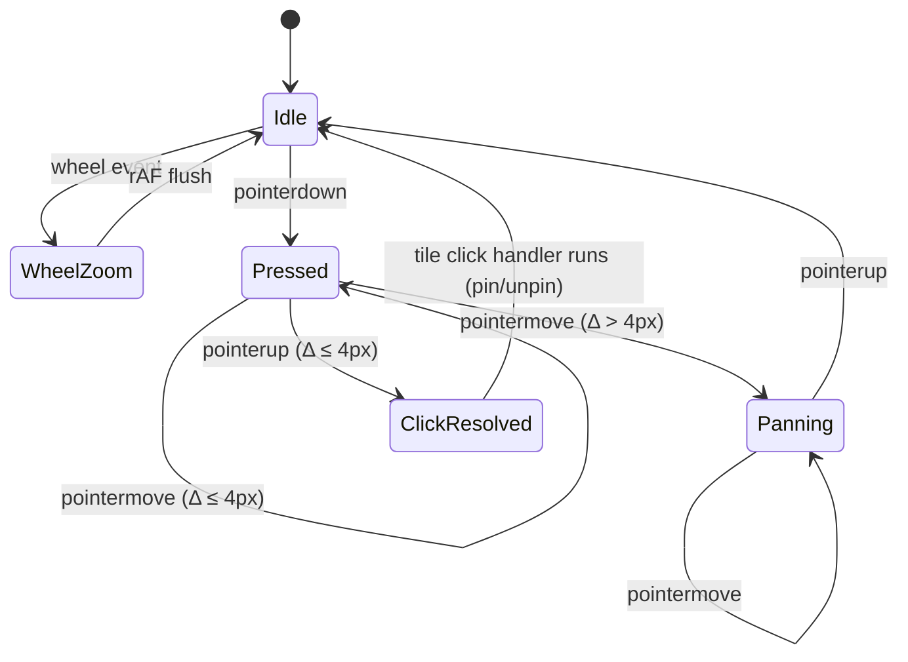

# feat: Treemap zoom and Level-of-Detail (LOD)

## Overview

Add cursor-anchored scroll-zoom + click-drag pan + zoom-aware LOD culling to the Constellation treemap. At fit-to-viewport (the initial state) the visualizer looks identical to today; as the user scrolls in, the existing `MIN_RENDER` cull becomes zoom-aware and progressively reveals smaller files. The squarified layout is computed once per viewport size; zoom is a pure visual transformation. Pin, hover, and agent-overlay anchoring all re-anchor on each zoom/pan tick via the existing `TileRegistry` + `getBoundingClientRect()` path.

## Problem Frame

On the user's Parsley codebase (much larger than Constellation itself), fit-to-viewport leaves individual files smaller than `MIN_RENDER: 8 px`, so most tiles are culled and the user sees mostly directory-colored void. The v1 onboarding flow now points the visualizer at sibling repos, so the typical target is much larger than Constellation. There is no current way to focus on a region — growing the browser window only buys a few pixels. Goal: a navigation primitive that progressively reveals smaller files as the user focuses in, and hides them as they pull back.

(See origin: `docs/brainstorms/zoom-and-lod-requirements.md`)

## Requirements Trace

All 15 requirements from the origin document are addressed by the implementation units below, grouped by the same logical themes the origin uses:

**Zoom navigation (R1–R5)**
- **R1** (cursor-anchored scroll zoom) → Unit 4
- **R2** (click-drag pan with 4-px guard) → Unit 5
- **R3** (zoom bounds: fit-to-viewport floor, soft cap) → Unit 3 (constants), Unit 4 (clamp)
- **R4** (pan bounds) → Unit 5
- **R5** (reset shortcut) → Unit 8

**Level-of-Detail (R6–R9)**
- **R6, R7** (zoom-aware MIN_RENDER cull) → Unit 6
- **R8** (line-clamp under zoom) → Unit 6 — **partially** addressed: text scales with zoom (legibility improves), but the line-clamp count remains derived from layout-px height, so the *number* of description lines does not grow with zoom. The full zoom-aware line-count behavior is deferred to a follow-up plan (see Open Questions).
- **R9** (squarify computed once per viewport) → Unit 2 (memoization)

**Overlay and panel anchoring (R10–R13)**
- **R10** (agent icons screen-size, re-anchor) → Unit 7
- **R11** (hover panel anchored through zoom/pan) → Unit 3 (relocation), Unit 7 (re-anchor)
- **R12** (pin survives zoom/pan) → Unit 7 (state preservation, re-anchor)
- **R13** (pinned-but-culled handling) → Unit 7 (registry-presence check)

**State and reflow (R14–R15)**
- **R14** (in-memory only, reset on reload) → Unit 3 (state lives in Visualizer)
- **R15** (resize re-clamps zoom and pan) → Unit 3 (clamp logic)

## Scope Boundaries

Carried forward from origin (still binding):
- No click-to-drill-in or directory-fills-viewport navigation.
- No minimap.
- No persistence of zoom/pan across reloads.
- No re-tessellation at zoom steps (squarify is computed once per viewport size).
- No "stay visible always" overrides for individual tiles. Cull is purely size-driven.
- No pinch-zoom or two-finger-gesture handling — trackpad two-finger scroll is treated as wheel events (per user choice; trackpad momentum overrun is an accepted trade-off).
- No scroll-wheel modifier semantics — plain scroll = zoom.
- No redesign of HoverPanel or AgentOverlay information architecture.
- No touch-device interaction.

Added during planning:
- **No keyboard navigation for the canvas itself** (zoom/pan via keyboard, tab-focusable tiles, screen-reader announcements). Matches the deferral pattern from the prior `visualizer-text-and-pin` plan; revisit as a future enhancement.
- **No first-paint scroll-to-zoom hint UI.** The brainstorm's open question about discoverability is acknowledged as a real gap, but adding a tooltip overlay expands scope. Revisit after observing real use.

### Deferred to Separate Tasks

- **Zoom-aware line-count for tile descriptions** — i.e., zooming in shows literally more description content, not just bigger text. MVP keeps line-count derived from layout-px height, so zoom scales the text but the count of clamped lines stays constant. A follow-up plan can promote this to a real requirement and thread `effectivePx = layoutPx * zoom` into the line-clamp math.
- **Agent-icon parking when its tile is culled** — today `useAgentPositions` falls back to `parkPosition()` when the registry has no entry. Under LOD, that fallback will fire whenever an agent's tile is culled by zoom-out. A nicer behavior is "park at nearest visible ancestor directory's centroid"; not in this plan, but worth a follow-up.

## Context & Research

### Relevant Code and Patterns

- **`components/Visualizer.tsx`** — owns hover/pin state, ResizeObserver-driven canvas size, calls `<TreemapNode>` with `(x=0, y=0, w=size.w, h=size.h)`. The home for new `zoom`/`pan` state and the wheel/pointerdown handlers.
- **`components/TreemapNode.tsx`** — recursive renderer. Calls `squarify()` inline on every render; this becomes the squarify-memoization target. The recursion gate (`canRender = inner.w >= MIN_RENDER && inner.h >= MIN_RENDER`) becomes zoom-aware.
- **`components/PinController.tsx`** — already owns the 4-px pointer-distance guard for unpin-on-empty-space, plus a double-rAF re-anchor effect on resize. This file is the natural home for the pan gesture (and for moving tile-pin from `onClick` to `onMouseUp` with the same guard). Existing positive-safelist via `data-path` / `data-hover-panel` / `data-agent-overlay` markers walked by `closest()`.
- **`components/HoverPanel.tsx`** — pointer-interactive (wheel scrolls inside the panel), `position: fixed` in viewport coords. Currently rendered inside the sized div; must move sibling-to the transformed wrapper or its `left/top` will be interpreted in scaled coords (CSS Transforms spec: a transformed ancestor becomes the containing block for `position: fixed` descendants).
- **`components/TileRegistry.tsx`** — context-wrapped `Map<path, HTMLElement>`, plus a `subscribe()` channel. `getBoundingClientRect()` on a registered element returns post-transform viewport rects, which is exactly what AgentOverlay and HoverPanel pin-mode want.
- **`hooks/useAgentPositions.ts`** — currently subscribes to `registry`, `agents`, `resize`, `scroll`. Extending the trigger set to include zoom/pan is the agent-side anchoring fix.
- **`lib/treemap.ts`** — pure squarify function `(items, rect) -> Rect[]`. No change needed; just memoize the call site.
- **`lib/constants.ts`** — `MIN_RENDER`, `DESCRIPTION_LINE_HEIGHT`, etc. The home for new `ZOOM_*` and `PAN_CLAMP_MARGIN` constants. The existing `POINTER_MOVE_THRESHOLD = 4` lives in `PinController.tsx:22`; promote it here as a shared constant.

### Institutional Learnings

- **`docs/solutions/ui-bugs/description-truncation-and-line-clamp-math-2026-04-30.md`** — Don't pre-bake LOD tiers in the scanner. Compute `effectivePx = layoutPx * zoom` at render time. The class of bug there (forced upstream truncation breaking downstream surfaces) is a direct warning against centralizing visibility decisions in `lib/scan/`.
- **`docs/plans/2026-04-30-001-feat-visualizer-text-and-pin-plan.md`** — The 4-px guard, positive-safelist via `data-*` markers, and `TileRegistry` re-anchor on resize are the prior-art the new gesture surface should extend rather than replace. `getBoundingClientRect()` under transforms returns post-transform rects — the existing re-anchor effect Just Works once we extend its trigger set to include zoom/pan.
- No prior learnings exist for CSS-transform layer-promotion, wheel `passive: false`, rAF-throttled subscriptions, or `position: absolute` performance at thousands-of-children scale. **Net-new institutional knowledge candidate** — capture via `/ce:compound` after Unit 1 measurement and after the feature ships.

### External References

External research was skipped — the codebase has solid local patterns to follow (TileRegistry, PinController, the existing 4-px guard) and the gesture model is custom enough that library shape (d3-zoom, react-zoom-pan-pinch) would not transfer cleanly. See Alternative Approaches Considered.

## Key Technical Decisions

- **Visual zoom via CSS transform, not layout recomputation.** A `transform: translate(...) scale(...)` on a wrapper around `<TreemapNode>`. GPU-accelerated, smooth, no per-step re-squarify cost. Squarified layouts are not stable under area changes, so re-tessellating per zoom step would shuffle tiles and disorient the user. *(carried from origin)*
- **LOD via zoom-aware `MIN_RENDER` threshold.** The recursion gate in `TreemapNode` switches from layout-px to rendered-px (`inner.w * zoom >= MIN_RENDER`). Reuses the existing cull primitive; current behavior is exactly the new behavior at `zoom=1`. *(carried from origin)*
- **Hidden tiles' area absorbed silently by parent.** No "+N hidden" placeholder; directory tile background fills the gap. *(carried from origin)*
- **Mouse model: scroll = zoom toward cursor; click-drag anywhere = pan.** Resolves the brainstorm's "pan from on-tile" gap (origin doc said "click-drag in empty space"; on Parsley there is no empty space). The fix is to **move tile-pin from `onClick` to `onMouseUp` with the existing 4-px guard**: a mouseup within 4 px of the mousedown is a pin-click; a mouseup beyond 4 px is the end of a pan gesture and the click is suppressed. The 4-px constant gets promoted from `PinController.tsx` to `lib/constants.ts` for sharing.
- **Trackpad scroll = wheel events; momentum overrun is accepted.** Per user choice on review (no modifier). Live with the macOS trackpad momentum behavior; address only if it proves intolerable in real use.
- **Squarify result is memoized per `<TreemapNode>` via `useMemo` keyed on `(items, rect)`.** Under the ref-driven transform architecture (next bullet), `TreemapNode` re-renders only on viewport-resize and on discrete `committedZoom` crossings — neither of which changes the rect when the layout dimensions are unchanged, so the memo never busts on continuous gestures. R9's invariant ("computed once per viewport size") becomes literal.
- **Zoom/pan use a ref-driven transform with a discrete LOD-quantized React state.** *(Architectural decision post-review; supersedes earlier rAF-coalesced-state design.)* `Visualizer` owns: (a) `liveZoomPanRef`, a ref holding the up-to-date `{zoom, pan}` (live values, no React state); (b) `committedZoom`, a React state that updates only when the live zoom diverges from it by ≥ `LOD_COMMIT_QUANTUM` (5%); (c) a per-frame event channel `subscribeTransformChange(cb)` for anchor consumers. Wheel and pointer handlers write to the ref synchronously, then schedule one rAF tick per frame; the tick mutates `wrapperRef.current.style.transform` directly, fires the event channel, and conditionally commits `committedZoom` on quantum crossings. **Why:** at Parsley scale (thousands of `<TreemapNode>` instances), routing zoom through React state would force O(N) reconciliation per detent — even with rAF coalescing, every frame would reconcile every tile. Ref-driven transform means React reconciles only when LOD actually changes (a few times per gesture, not per wheel event); this is the standard pattern in d3-zoom, react-zoom-pan-pinch, and Framer Motion.
- **`ZoomPanContext` exposes three things, all read-only from a consumer's perspective.** `committedZoom` (React state — `TreemapNode`'s LOD gate reads this); `subscribeTransformChange(cb)` (event channel — `useAgentPositions` and `PinController` subscribe to re-anchor on every transform change, calling `getBoundingClientRect()` which automatically reflects the live transform); `getLive()` (ref read — used by the wheel-zoom math in Unit 4 and the reset shortcut in Unit 8). Live `{zoom, pan}` values are *never* exposed as React state, by design.
- **HoverPanel relocates sibling-to the transformed wrapper.** Required for `position: fixed` to mean viewport coords. Existing pin-mode anchoring continues to read `getBoundingClientRect()` on every zoom/pan change (no cached click coords) so the panel slides with its tile. *(auto-fixed during review)*
- **Cursor-anchored zoom math: fixed `transform-origin: 0 0` + compensating translate.** Standard formula: `newPan = cursorPos - (cursorPos - oldPan) * (newZoom / oldZoom)`. Avoids transform-origin gymnastics; pan stored uniformly as a translate offset.
- **Pan clamp: hard clamp at gesture time. At least 30% of the canvas's smaller dimension stays in view** in each axis. Configurable via `PAN_CLAMP_MARGIN`.
- **Reset key: `f` (fit).** Avoids the Esc conflict (Esc is already an unpin shortcut). **Reset does not unpin** — preserves the user's pinned-tile attention.
- **`R13`: pinned-but-culled keeps the pin, hides the panel.** Detection is `registry.get(pinnedPath) === undefined` (culled tiles never call `useRegisterTile`). *(carried from origin; auto-fixed during review)* Risk: the user can lose track of a hidden pin. Listed in Risks & Mitigation.
- **No drill-in, no library reuse.** See Alternative Approaches Considered.

## Open Questions

### Resolved During Planning

- **R8 line-clamp behavior under zoom** — Resolved (partial): MVP is "text scales with zoom; line-clamp count stays constant." This satisfies the legibility intent of R8 (descriptions become readable as you zoom in) but not the full "more lines fit" wording. The full zoom-aware line-count behavior is deferred to a follow-up plan; the origin doc R8 wording will be amended when this ships (see Documentation Plan).
- **Pan-from-on-tile** — Resolved: tile-pin moves from `onClick` to `onMouseUp` + 4-px guard. Drag-anywhere pans, click-anywhere (≤4 px) preserves the existing pin gesture.
- **Reset shortcut binding** — Resolved: `f`. Does not unpin.
- **Transform-origin / coordinate space** — Resolved: `transform-origin: 0 0`; pan stored in layout-px; cursor-anchored zoom via compensating translate.
- **`ZOOM_MAX`** — Resolved: 8× soft cap; raisable via constant.
- **`ZOOM_STEP`** — Resolved: ~1.15 per detent. Tunable.
- **rAF-throttled anchor invalidation mechanism** — Resolved: single Visualizer-owned coalescer ticks the `ZoomPanContext` at most once per frame; consumers re-render reactively.
- **Pan clamp distance** — Resolved: 30% of canvas smaller-dimension in each axis.
- **`R15` zoom storage** — Resolved: zoom is stored as an absolute scale factor (≥ 1.0). On resize, `ZOOM_MIN` is re-derived (always = 1.0 in the new layout space) before clamping; pan is re-clamped against new bounds.
- **Wheel-over-HoverPanel** — Resolved: wheel handler attached at the visualizer container, not document. Wheel events over HoverPanel never reach the zoom handler because the panel is a sibling of the wrapper (and pointer events bubble to the panel's overflow scroll).
- **Cursor states** — Resolved: `cursor: default` baseline; `cursor: grab` while a pointerdown is held in empty space and threshold not yet crossed; `cursor: grabbing` mid-pan-drag; tile cursor stays `pointer`.

### Remaining decisions resolved (post-review)

Eight findings surfaced after the document-review pass. All resolved here; the unit text above already reflects each resolution.

1. **Architectural: context-driven re-renders at Parsley scale → Option B (ref-driven transform + LOD-quantized state).** Routing live `{zoom, pan}` through React state would force O(N) `<TreemapNode>` reconciliation per detent, even with rAF coalescing. Resolution: `Visualizer` owns a `liveZoomPanRef` and an rAF tick that mutates `wrapperRef.style.transform` directly (no React state for continuous values); `committedZoom` React state updates only on `LOD_COMMIT_QUANTUM` (5%) crossings; anchor consumers subscribe to a `subscribeTransformChange` event channel and re-anchor by reading `getBoundingClientRect()`. This is the standard pattern in d3-zoom, react-zoom-pan-pinch, and Framer Motion. Updates Units 1, 3, 4, 5, 6, 7, 8.
2. **LOD flicker hysteresis at the threshold — Skipped for MVP.** With `LOD_COMMIT_QUANTUM = 5%`, the user has to actively oscillate zoom around a tile's threshold to trigger flicker; rare. Add a hysteresis pair (`LOD_SHOW`/`LOD_HIDE`) only if observed in real use.
3. **Pinned-but-culled visual signal — Zero (no signal).** Same reasoning as no "+N hidden" placeholder: matches the "small files hidden inside bigger" intent, minimizes visual noise. Risks-table mitigation (auto-unpin after Nms culled) is the escalation path.
4. **Unit 1 prototype residue — Keep `app/dev/zoom-perf/` as a permanent dev-only perf bench.** A 5,000-tile synthetic tree is reproducible across time; Parsley isn't. One unlinked dev route is cheap insurance for future scale work. Reflected in Unit 1's revised Files + Verification text.
5. **Pan clamp reference frame — Keep viewport-relative (`PAN_CLAMP_MARGIN * min(viewport.w, viewport.h)`).** Only breaks if `ZOOM_MIN` ever drops below 1, which the plan explicitly forbids. Flag for re-evaluation only if that constraint changes.
6. **Zoom=1 stacking context — Always emit the transform (no identity special-case).** A transformed wrapper is the containing block for `position: fixed` descendants; conditionally omitting it changes layout behavior between `zoom=1` and `zoom=1.0001`. Behavioral consistency > tiny render shortcut. Under B this is moot anyway (transform is mutated imperatively, never absent).
7. **HoverPanel overlap at high zoom — Accept.** Origin scope says "no redesign of HoverPanel"; users dismiss with Esc or click. Truncate/move logic adds non-load-bearing complexity for a second-order concern.
8. **Reset (`f`) animation — Instant, no easing.** Origin doc explicitly calls easing polish-not-requirement; ~5 lines to add easing later if it feels jarring in practice.

### Deferred to Implementation

- **Exact `ZOOM_STEP` feel** — 1.15× may feel slow or fast in practice. Adjust by feel during Unit 4 verification.
- **`PAN_CLAMP_MARGIN` exact value** — 30% is a starting point; may want softer (50%) or stricter (10%). Adjust by feel during Unit 5 verification.
- **rAF-tick idiom** — `requestAnimationFrame` with a `frameScheduledRef` boolean flag is the default. If React 19's `useSyncExternalStore` proves cleaner for the subscriber channel during Unit 7, swap (the live ref + imperative transform mutation stays the same; only the subscribe primitive changes).
- **Squarify memoization placement** — `useMemo` inside `TreemapNode` is the smallest change and is the default. If profiling in Unit 1 shows `TreemapNode` re-rendering excessively, hoist the layout to a `Visualizer`-level `useMemo` and pass children as props.
- **Whether HoverPanel's pin-mode anchor needs its own subscriber callback** or can piggyback on `PinController`'s subscriber (which already does the registry lookup + position computation). Default: piggyback. Decide while wiring Unit 7.

## High-Level Technical Design

> *This illustrates the intended approach and is directional guidance for review, not implementation specification. The implementing agent should treat it as context, not code to reproduce.*

**New JSX structure inside `Visualizer`** (HoverPanel and AgentOverlay sibling-to the transformed wrapper; transform mutated imperatively on `wrapperRef`):

```
<HoverContext.Provider>
  <TileRegistryProvider>
    <ZoomPanContext.Provider value={{ committedZoom, subscribeTransformChange, getLive }}>
      <div ref={containerRef}>           // visualizer container, owns wheel + pointer handlers
        <div ref={wrapperRef}             // NEW: transformed wrapper; style.transform is mutated
          style={{                        //      imperatively in the rAF tick — initial value
            transformOrigin: "0 0",       //      written via useLayoutEffect to avoid first-frame flash
            width: size.w, height: size.h,
          }}>
          <TreemapNode … />               // reads committedZoom from context for LOD gate
        </div>
        <HoverPanel … />                  // MOVED: sibling-to wrapper; subscribes to onTransformChange in pin mode
      </div>
      <AgentOverlay … />                  // sibling-to container; useAgentPositions subscribes to onTransformChange
      <PinController … />                 // gains pan gesture handling; subscribes to onTransformChange
    </ZoomPanContext.Provider>
  </TileRegistryProvider>
</HoverContext.Provider>
```

**Gesture state machine for the visualizer container:**



**Cursor-anchored zoom math:**

```
// On wheel event, deltaY < 0 = zoom in, deltaY > 0 = zoom out
factor   = deltaY < 0 ? ZOOM_STEP : 1 / ZOOM_STEP
newZoom  = clamp(zoom * factor, ZOOM_MIN, ZOOM_MAX)
// Keep world point under cursor stationary on screen:
newPan.x = cursorX - (cursorX - pan.x) * (newZoom / zoom)
newPan.y = cursorY - (cursorY - pan.y) * (newZoom / zoom)
newPan   = clamp(newPan, panBounds(newZoom, viewport, layoutSize))
```

## Implementation Units

- [ ] **Unit 1: Transform-stack performance sanity check (permanent dev route)**

**Goal:** Validate that CSS-transform on a wrapper containing thousands of `position: absolute` children — driven imperatively (no React state) — stays smooth (>50 FPS during continuous zoom and pan) on Constellation's actual rendering pipeline. **Note:** under the ref-driven architecture, the O(N)-React-reconciliation concern is resolved by design, so Unit 1's role narrows to a transform-layer sanity check (paint cost, layer promotion, Safari text rasterization). The route is kept as a permanent dev-only baseline — when scale grows or new features land, this is the reproducible test bench.

**Requirements:** None directly; sanity-checks the transform layer used by every later unit.

**Dependencies:** None.

**Files:**
- Create: `app/dev/zoom-perf/page.tsx` — a permanent developer-only route (not linked from the home page) that renders a synthetic 5,000-tile tree under a wrapper whose `style.transform` is mutated imperatively in an rAF tick driven by wheel/drag handlers. Models the same ref-driven pattern Unit 3 will land for real, so the measurement is representative.
- Create: `lib/scan/synthetic.ts` — a small helper that builds a `CodebaseTree` of ~5,000 fake `FileNode`s under nested directories, sized similarly to a real large repo (heavy-tail line counts).

**Approach:**
- Reuse `<TreemapNode>` and `lib/treemap.ts` as-is — the prototype is a real pipeline test, not a microbenchmark.
- Implement the transform driver the same way Unit 3 will: a `liveZoomPanRef`, an rAF tick that mutates `wrapperRef.current.style.transform` and fires a subscribe channel, no continuous React state. This makes the measurement a true preview of production behavior, not a misleading "naive useState" baseline.
- Manual record in Chrome DevTools Performance tab during a 5-second wheel-zoom and a 5-second drag-pan. Record FPS, layout-thrash count, and paint-area metrics in both Chrome and Safari (the two browsers Constellation supports).
- **Decision gate:**
  - **>50 FPS sustained, no per-frame layout thrash** → proceed to Unit 2.
  - **30-50 FPS, occasional thrash** → proceed to Unit 2 *and* plan to add `will-change: transform` on the wrapper + a `contain: paint` on the wrapper. Re-measure after Unit 4.
  - **<30 FPS or visible jank** → stop. Replan the rendering layer (canvas-based, virtualized DOM, or `react-window`-style virtualization keyed on visible region). This is a separate plan; this plan does not survive.

**Patterns to follow:**
- Existing `app/page.tsx` for the route shape (server component reading `process.cwd()` + passing to a client `<Visualizer>`-style wrapper). The synthetic tree replaces the real `scanProject()` call.

**Test scenarios:**
- *Happy path:* wheel-zoom from `1×` to `8×` over 3 seconds in Chrome. FPS stays above 50; no dropped frames in DevTools Performance flame chart.
- *Happy path:* drag-pan across the canvas for 5 seconds in Chrome. Same FPS bar.
- *Edge case:* same two scenarios in Safari. Safari historically rasterizes text per-frame on transform changes; observed.
- *Stress:* zoom in to `8×` and drag-pan rapidly. Verify no memory growth over 30 seconds (Chrome DevTools Memory tab — heap stable).

**Verification:**
- Performance metrics recorded in a comment at the top of `app/dev/zoom-perf/page.tsx` (so future readers see the baseline). The route stays in the tree as a permanent perf bench. The decision gate result determines whether Unit 2+ proceed.

---

- [ ] **Unit 2: Squarify memoization**

**Goal:** Eliminate per-render re-tessellation in `<TreemapNode>` so adding zoom/pan state to `Visualizer` does not cause squarify to re-run on every wheel detent.

**Requirements:** R9.

**Dependencies:** Unit 1 (architecture validated).

**Files:**
- Modify: `components/TreemapNode.tsx` — wrap the inline `squarify(items, inner)` call in `useMemo` keyed on the children array reference and the inner rect.

**Approach:**
- The current call-site does `squarify(node.children.map(c => ({value: …})), inner)`. Both the mapped `items` array and the `inner` object are constructed inline every render, so a naive `useMemo([items, inner], …)` would never hit the cache.
- The fix: memo on **primitive scalar dependencies** plus the *original* `node.children` reference (which is stable for a given tree). Pattern:
  - Build the items array *inside* the memo body, not outside.
  - Use `[node.children, inner.x, inner.y, inner.w, inner.h]` as the dep list (children ref + four primitive scalars), not the constructed `items`/`inner` objects.
- This keys the memo on what actually changes (children identity + rect dimensions) and ignores re-construction noise.
- Verify by adding a one-shot `console.count()` inside the memo body during Unit 4's wheel-zoom test — the count should not grow on wheel events at zoom=1. **Also verify under React StrictMode** (which double-invokes effects in dev) and after a forced parent re-render.

**Patterns to follow:**
- Existing `useMemo` use in `Visualizer.tsx` (`filesByPath`).

**Test scenarios:**
- *Happy path:* render Constellation at zoom=1; the visualizer looks pixel-identical to today (no regression).
- *Happy path (verification of memo):* trigger a forced re-render of `<Visualizer>` (e.g., add a dummy state and toggle it). The squarify call count should not grow proportionally.
- *Edge case:* viewport resize triggers re-squarify exactly once.

**Verification:**
- The visualizer renders identically to pre-change. With React DevTools Profiler, a forced parent re-render at fixed viewport size shows no work attributed to `squarify` in `<TreemapNode>` instances whose props are unchanged.

---

- [ ] **Unit 3: Zoom/pan ref scaffold, transform wrapper, HoverPanel relocation**

**Goal:** Land the structural scaffold under the ref-driven architecture: live `{zoom, pan}` in a ref owned by `Visualizer`; an rAF tick that mutates the wrapper's `style.transform` imperatively; `committedZoom` React state for LOD; `subscribeTransformChange` event channel for anchor consumers; HoverPanel relocated as a sibling of the wrapper. No new gestures yet — initial state `zoom=1, pan=(0,0)` means the visualizer still looks identical.

**Requirements:** R3 (constants + bounds), R9 (wrapper shape), R11 (panel relocation), R14 (in-memory state), R15 (resize re-clamp).

**Dependencies:** Unit 2.

**Files:**
- Create: `components/ZoomPanContext.tsx` — React context providing `{ committedZoom, subscribeTransformChange, getLive }`. The provider implementation also owns the rAF tick, the live ref, the subscriber `Set`, and the imperative writer used by `Visualizer`'s wheel/pointer handlers (Units 4, 5).
- Modify: `components/Visualizer.tsx` — wire the new context provider, render the new wrapper with a `wrapperRef`, **move `<HoverPanel>` to be a sibling of the wrapper**, and trigger re-clamp on container resize.
- Modify: `lib/constants.ts` — add `ZOOM_MIN = 1`, `ZOOM_MAX = 8`, `ZOOM_STEP = 1.15`, `PAN_CLAMP_MARGIN = 0.3`, `LOD_COMMIT_QUANTUM = 0.05` (5% — `committedZoom` updates only when the live zoom diverges from it by ≥ this fraction; keeps `TreemapNode` reconciliation rare). (`POINTER_MOVE_THRESHOLD` is also promoted here, but that move belongs to Unit 5 where it is first needed by a second consumer.)

**Approach:**
- **Live values in a ref.** `liveZoomPanRef.current = { zoom: 1, pan: {x: 0, y: 0} }`. Wheel/pointer handlers (Units 4, 5) write to this ref synchronously, then call the provider's `scheduleFrame()`.
- **rAF tick (single writer for everything visible).** `scheduleFrame()` uses a `frameScheduledRef` flag to enqueue at most one `requestAnimationFrame` per frame. Inside the tick: clear the flag; clamp pan against current viewport + layout; mutate `wrapperRef.current.style.transform = "translate(${pan.x}px, ${pan.y}px) scale(${zoom})"`; iterate the subscriber `Set` (`subs.forEach(cb => cb())`); if `Math.abs(live.zoom - committedZoom) / committedZoom >= LOD_COMMIT_QUANTUM`, call `setCommittedZoom(live.zoom)`. (At very small zoom changes the LOD commit is skipped; at gesture end, write a final commit so `committedZoom` always converges to the live value.)
- **Subscribe channel.** `subscribeTransformChange(cb)` adds `cb` to a ref-held `Set<() => void>` and returns an `unsubscribe`. Consumers subscribe in `useEffect`; the callback typically calls a local `setState` or directly mutates a DOM ref to re-anchor an icon/panel — anchor consumers do `getBoundingClientRect()` reads from inside the callback, which return post-transform coords automatically.
- **`getLive()`** returns `liveZoomPanRef.current` for one-shot reads — used by Unit 4's wheel math (cursor-anchor formula needs the current pan/zoom) and Unit 8's reset.
- **Pan clamp helper:** `clampPan(pan, zoom, viewport, layoutSize) → pan`. At `zoom=1` the layout fills the viewport so pan is clamped to (0,0). At higher zooms the scaled layout overflows; pan is clamped so at least `PAN_CLAMP_MARGIN * min(viewport.w, viewport.h)` of the canvas remains in view per axis.
- **On viewport resize:** `Visualizer` already has the `ResizeObserver`. On resize, write the clamped live values back to the ref, call `scheduleFrame()` (so the tick mutates transform + fires subscribers + commits LOD if needed). `ZOOM_MIN` is always 1.0 in the new layout space.
- **Initial mount:** `useLayoutEffect` writes the initial transform to the wrapper before paint, so the first frame is identity (avoids a flash from an unstyled wrapper).

**Patterns to follow:**
- `components/TileRegistry.tsx` is the closest analog — ref-held mutable map + subscribe channel; copy that shape.
- `components/Visualizer.tsx` resize observer for triggering re-clamp.

**Test scenarios:**
- *Happy path:* visualizer renders identically to pre-change at `zoom=1, pan=(0,0)`. Pin/hover/agent overlay all behave exactly as today.
- *Happy path:* expose a temporary `window.__writeLive` dev hook that calls the provider's writer; from the DevTools console run `__writeLive({zoom: 2, pan: {x: 0, y: 0}})`. Canvas scales 2× from the top-left immediately. HoverPanel anchors correctly to its tile (post-transform `getBoundingClientRect`).
- *Edge case:* resize the browser window. Pan is re-clamped; visualizer remains rendered correctly with no off-canvas drift; subscribers fire.
- *Edge case:* pin a tile, then `__writeLive({zoom: 2, pan: {...}})`. The pinned panel re-anchors to the tile at its new screen position (full coverage in Unit 7; this unit verifies the structural piece works).
- *Regression:* HoverPanel's wheel-scroll behavior over long descriptions still works (panel is now a sibling of the wrapper, so its `position: fixed` resolves in viewport coords).
- *Profiler check:* during a sequence of `__writeLive` calls covering the full zoom range without crossing 5% quanta, React DevTools Profiler shows zero re-renders for `<TreemapNode>` instances. Crossing a quantum produces exactly one batch of `TreemapNode` re-renders.

**Verification:**
- Default visualizer (zoom=1) is pixel-identical to pre-change.
- Manual `__writeLive` calls produce visually correct scaling without React state churn for `TreemapNode` (verified in Profiler).
- HoverPanel positions correctly at any zoom level set manually.
- Subscribers correctly fire on every rAF tick; unsubscribe on unmount cleans the `Set` (no leaks).

---

- [ ] **Unit 4: Cursor-anchored wheel zoom**

**Goal:** Implement scroll-wheel zoom toward the cursor with the formula in High-Level Technical Design. Wheel events on the transform wrapper `preventDefault` (so the page doesn't scroll behind) and feed updates through the ref-driven writer + `scheduleFrame()` from Unit 3.

**Requirements:** R1, R3.

**Dependencies:** Unit 3.

**Files:**
- Modify: `components/Visualizer.tsx` — attach `wheel` event listener (`{ passive: false }`) to the wrapper. Compute new zoom + pan, write to `liveZoomPanRef`, call `scheduleFrame()`.

**Approach:**
- `wheel` event handler attached to the **transform wrapper** (not the container) via `useEffect` + `addEventListener` with `{ passive: false }`. Why the wrapper and not the container: events bubble from descendants up through ancestors, so a listener on the container would *also* receive wheel events whose target is inside `<HoverPanel>` (HoverPanel is a sibling of the wrapper but a descendant of the container per the new JSX). Listening on the wrapper means panel wheel events never reach the zoom handler — this is structural, not based on bubbling-stops-at-siblings (which is incorrect CSS reasoning).
- `e.preventDefault()` is called only when the event reaches the wrapper handler (i.e., target is on the canvas, not on the panel).
- Read `deltaY`. The formula must be sensitive to wheel-event magnitude because mouse-wheel detents emit `deltaY ≈ ±100` while macOS trackpad emits ~30 events/sec with `deltaY` ~2-10 each: a fixed `ZOOM_STEP` per event would cap-out within milliseconds on a trackpad. Use a magnitude-aware formula:
  - `factor = Math.exp(-deltaY * ZOOM_SENSITIVITY)` where `ZOOM_SENSITIVITY ≈ 0.005` (tunable in Unit 4 verification).
  - This makes one mouse-wheel detent (~100 deltaY) feel like ~1.65× zoom and one trackpad event (~5 deltaY) feel like ~1.025× — both feel right.
  - Clamp `factor` itself to `[1/2, 2]` per event to prevent extreme overshoot from any single rogue event.
- Apply the cursor-anchored math in High-Level Technical Design, reading current zoom/pan via `getLive()`. Clamp result via the Unit 3 helper.
- Write the new `{zoom, pan}` directly into `liveZoomPanRef.current`, then call `scheduleFrame()`. Multiple wheel events arriving in the same frame all write the latest values to the ref; the single rAF tick mutates the transform and fires subscribers exactly once per frame regardless of event volume.

**Patterns to follow:**
- Existing `addEventListener` + `removeEventListener` shape in `useEffect` (e.g., `PinController.tsx`'s window-level handlers).

**Test scenarios:**
- *Happy path:* wheel-up over an arbitrary point on the canvas. Zoom increases; that point stays under the cursor.
- *Happy path:* wheel-down repeatedly. Zoom decreases; clamps at `ZOOM_MIN = 1.0` (canvas exactly fills viewport, no smaller).
- *Happy path:* wheel-up repeatedly. Zoom clamps at `ZOOM_MAX = 8`.
- *Edge case:* wheel events fire ~60Hz from a Mac trackpad with momentum. The rAF tick absorbs them — verify only one transform mutation per animation frame via `console.log` in the tick.
- *Edge case:* wheel over the HoverPanel scrolls the panel's content (not the canvas).
- *Edge case:* the page never scrolls behind the visualizer — `preventDefault` is firing.
- *Regression:* pin a tile, wheel-zoom; pin survives (state unchanged) — full re-anchor verified in Unit 7.

**Verification:**
- Cursor-anchored zoom feels natural on a real mouse (~3 seconds to go from `1×` to `8×` and back).
- No console errors; no page scroll bleed-through.
- React DevTools Profiler during a 1-second wheel-zoom shows zero `<TreemapNode>` re-renders for sub-quantum changes, and at most a handful of `<TreemapNode>`-tree reconciliations across the full zoom range (one per `LOD_COMMIT_QUANTUM` crossing).

---

- [ ] **Unit 5: Drag pan + tile-pin gesture migration**

**Goal:** Implement click-drag pan via `pointerdown`/`pointermove`/`pointerup` on the visualizer container, while migrating tile-pin from `onClick` to `onMouseUp` with the existing 4-px guard so drag-on-tile pans naturally.

**Requirements:** R2, R4.

**Dependencies:** Unit 3.

**Execution note (load-bearing):** This unit migrates the most-tested gesture surface in the visualizer. Critical to get right:
- Unit 4 (wheel) and Unit 5 (pointer) both attach listeners on the wrapper/container; coordinate via a single `useEffect` that owns the full gesture handler set, or two effects sharing the same ref.
- All the existing pin/unpin code paths must continue to work — the test scenarios below enumerate every one. Bias toward small, observable steps; verify after each change rather than at the end.

**Files:**
- Modify: `components/Visualizer.tsx` — attach `pointerdown`/`pointermove`/`pointerup` handlers (on the container). Track gesture state: `Idle | Pressed | Panning`. Apply cursor styling.
- Modify: `components/TreemapNode.tsx` — **remove `onClick={onTileClick}` from the file tile `<article>`.** The pin gesture moves to `Visualizer`'s `pointerup` handler, which checks distance + `e.target.closest('[data-path]')`. The existing `data-path` attribute is the single tile marker; no new attribute needed.
- Modify: `components/PinController.tsx` — keep the Esc-to-unpin handler. Keep the rAF re-anchor effect (Unit 7 extends it). The window-level `click` handler that today unpins on empty-space click stays as a **safety net for clicks outside the visualizer** (e.g., on the page header) — it already uses `closest('[data-path], [data-hover-panel], [data-agent-overlay]')` to decide. This is intentional belt-and-suspenders, not redundancy: the new pointerup handler in `Visualizer` only sees pointer events on the container; clicks elsewhere on the document still need the existing PinController path.
- Modify: `lib/constants.ts` — promote `POINTER_MOVE_THRESHOLD = 4` here (was at `PinController.tsx:22`). Both `Visualizer` (new) and `PinController` (existing) import it.

**Approach:**
- `pointerdown` on the container:
  - **Filter:** if `e.button !== 0`, ignore (right-click, middle-click should not initiate gestures or pin).
  - Record `{x: e.clientX, y: e.clientY}` and the `e.target`.
  - Capture the pointer on **the container ref**, not `e.target` — capturing on a child element means subsequent `pointermove` fires on that child, breaking the gesture state machine if the cursor moves to a different tile mid-drag. Pattern: `containerRef.current.setPointerCapture(e.pointerId)`.
- `pointermove`:
  - if state is `Pressed` and movement > `POINTER_MOVE_THRESHOLD`: transition to `Panning`; set `cursor: grabbing`.
  - if state is `Panning`: compute new pan = old pan + (current - last) movement; clamp via the Unit 3 helper; write `{zoom: getLive().zoom, pan: clamped}` to `liveZoomPanRef.current`, then call `scheduleFrame()`.
  - **While in `Panning`**: suppress hover updates. The existing `onMouseMove={(e) => setHover(node.path, ...)}` handler on `<FileTile>` would otherwise spam `setHover` on every frame across many tiles, jittering the hover panel and adding render cost. Easiest fix: in `Visualizer`, when the gesture state is `Panning`, ignore the `setHover` calls coming up from tiles (e.g., gate via context flag, or skip in `Visualizer`'s `setHover` callback).
- `pointerup`:
  - if state is `Pressed` (≤ 4 px movement): treat as a click. Inspect `e.target.closest('[data-path]')`:
    - non-null → pin/unpin via `setPinned`.
    - null → click is in empty space within the visualizer → unpin.
  - if state is `Panning`: end of pan, no click action. Cursor returns to `default`.
- **Cursor states** (apply via `cursor: ...` on the container, with tile elements overriding via inline class):
  - `default` baseline (idle, pointer over empty space).
  - **Pointer over a tile, idle**: `cursor: grab` — communicates "you can drag from here." This is a deliberate change from the current `pointer` cursor on tiles; the brainstorm review flagged that without this signal, drag-from-tile is undiscoverable on Parsley (where there is no empty space).
  - **Mid-drag past threshold (state = Panning)**: `cursor: grabbing` (override on the container).
- Pan clamp engages during the gesture (each `pointermove` sets a clamped value), not at gesture end.
- **Wheel hits the zoom-cap (`ZOOM_MIN` / `ZOOM_MAX`):** continue to call `preventDefault()` on the wheel event so the page does not scroll. The visualizer fills the viewport so there is no "page underneath" to scroll anyway; this is a no-op for the user once clamped.

**Patterns to follow:**
- `PinController.tsx`'s existing 4-px guard logic (now using the shared constant from Unit 3).
- Pointer-capture pattern: `e.target.setPointerCapture(e.pointerId)` so pointermove keeps reporting even if the pointer leaves the wrapper.

**Test scenarios:**
- *Happy path:* click a tile (mousedown + mouseup, no movement). Tile pins. Identical to today.
- *Happy path:* click an already-pinned tile. Tile unpins.
- *Happy path:* click in empty space. Unpins any pinned tile.
- *Happy path:* mousedown on a tile, drag 50px, release. The treemap pans; the tile under the original press is **not pinned** (drag suppressed the click).
- *Happy path:* mousedown in empty space, drag 50px, release. Treemap pans. No pin/unpin.
- *Edge case:* mousedown, move 3 px, release. Tile pins (within the 4-px guard).
- *Edge case:* mousedown, move 5 px, release. Pan happens; no pin click.
- *Edge case:* right-click on a tile. Nothing happens (no pin, no pan) — the `e.button === 0` filter rejects it.
- *Edge case:* middle-click on a tile. Nothing happens.
- *Edge case:* during a pan-drag, the cursor crosses many tiles. The hover panel does NOT flicker across them — hover updates are suppressed while `Panning`.
- *Edge case:* drag pan all the way to the clamp limit. Pan stops at the clamp; no overshoot.
- *Edge case:* click on `<HoverPanel>` (e.g., its X close button). Clicks inside the panel still work — the panel is a sibling and pointer events bubble there directly, not to the container's pointerdown. Verify: pinning a tile, clicking the X closes the panel; clicking text inside the description selects text (not pin).
- *Edge case:* click on an `AgentOverlay` icon. Existing behavior: `pointer-events: none` lets the click fall through to the tile beneath. Verify still works.
- *Regression:* trackpad scroll-release synthetic clicks (the original reason the 4-px guard exists). Should still be rejected as not-a-click.

**Verification:**
- All click/drag scenarios above behave correctly on a desk mouse and on a Mac trackpad.
- Visual: cursor changes from `default` → `grab` → `grabbing` cleanly during a drag gesture.

---

- [ ] **Unit 6: Zoom-aware MIN_RENDER cull**

**Goal:** Make the existing `MIN_RENDER` recursion gate in `<TreemapNode>` zoom-aware, so zooming in promotes previously-culled tiles into rendered ones, and zooming out demotes them.

**Requirements:** R6, R7, R8.

**Dependencies:** Unit 3 (ZoomPanContext available).

**Files:**
- Modify: `components/TreemapNode.tsx` — consume `committedZoom` from `ZoomPanContext`; change the gate from `inner.w >= MIN_RENDER` to `inner.w * committedZoom >= MIN_RENDER` (and same for height).

**Approach:**
- Read `committedZoom` once at the top of `TreemapNode` via `useZoomPan()`. **Critical:** read `committedZoom` (the React state), *not* `getLive().zoom`. The whole point of the ref-driven architecture is that `TreemapNode` reconciles only on quantum-crossing commits, not every wheel event. Reading the live value would force per-detent reconciliation and re-create the O(N) problem the architecture exists to avoid.
- Use `committedZoom` in the `canRender` gate. Because `committedZoom` only updates on ≥ `LOD_COMMIT_QUANTUM` (5%) divergence, tiles flip between rendered/culled in batches of ~5% zoom changes — visually indistinguishable from continuous LOD, but ~20× cheaper at scale.
- The existing per-tile description line-clamp math (`floor(availableHeight / DESCRIPTION_LINE_HEIGHT)`) keeps using **layout-px** `availableHeight`. Result: at higher zoom, text scales up but the line count stays constant. **R8 MVP interpretation, deferred to follow-up: zoom-aware line-count.**
- No change to filename/header rendering — they stay layout-px-sized and scale with the transform.
- Verify "hidden tiles' area is silently absorbed by the parent": when a child fails the gate, the parent directory's background color shows through the rect that would have held the child. This is already how the current renderer works (no children → directory bg fills the inner rect).

**Patterns to follow:**
- `TreemapNode.tsx:67-68` existing gate.
- The institutional learning from `docs/solutions/ui-bugs/description-truncation-and-line-clamp-math-2026-04-30.md`: do **not** recompute `availableHeight` to be zoom-aware; that's the next-gen behavior, deferred.

**Test scenarios:**
- *Happy path:* at `zoom=1` on Constellation, no regression — tiles render exactly as today.
- *Happy path:* zoom in to `2×` on Parsley. Files that were previously below threshold now render. The visible set expands progressively as zoom increases.
- *Happy path:* zoom out from `4×` to `1×`. Tiles disappear progressively as their rendered px drops below threshold.
- *Edge case:* on Constellation at `1×`, `inner.w * zoom = inner.w` — gate behavior is identical to current.
- *Edge case:* a directory that newly clears the gate at `zoom=2` becomes available for recursion; its children are also gated, so progressive reveal happens at multiple levels.
- *Stress:* on Parsley at `zoom=8`, a small directory should render most of its children. No DOM explosion.
- *Regression:* `__collapsed__` placeholder tiles (from `SCAN_LIMITS`) behave like normal tiles under zoom — they don't try to recurse further, since they're file-shaped.

**Verification:**
- Zooming in on a culled directory progressively reveals its children. Zooming out reverses.
- No flicker or off-by-one promotion at threshold crossings.
- DOM node count stays bounded — when zoomed in to a small region, only that region's tiles render (the rest are still culled).

---

- [ ] **Unit 7: Anchor re-computation across zoom and pan**

**Goal:** Make agent icons, the hover panel (in pin mode), and the pinned-tile ring border all re-anchor on every zoom/pan tick. R12 (pin survives zoom/pan) and R13 (pinned-but-culled hides panel) land here.

**Requirements:** R10, R11, R12, R13.

**Dependencies:** Unit 3, Unit 6 (so `registry.get(pinnedPath) === undefined` accurately reflects culled state).

**Files:**
- Modify: `hooks/useAgentPositions.ts` — subscribe to `ZoomPanContext.subscribeTransformChange` in addition to the existing `[registry, agents.length, viewport size, scroll]` triggers. Recompute on every transform-change tick.
- Modify: `components/PinController.tsx` — extend the existing rAF re-anchor effect (currently subscribes to `resize`) to also subscribe to `subscribeTransformChange`. **Read the pinned tile's `getBoundingClientRect()` on every recompute, not cached click coordinates.**
- Modify: `components/HoverPanel.tsx` — in pin mode, position is derived from the tile's current `getBoundingClientRect()` (passed in by `PinController` via props), not from `pinnedPos` (cached click). The R13 hide rule: HoverPanel renders nothing in pin mode when its incoming `position` prop is `null`.

**R13 ownership (split of responsibility):** `PinController` reads the registry on every re-anchor frame. If `registry.get(pinnedPath)` returns `undefined`, it passes `position: null` to `HoverPanel`. `HoverPanel` itself only checks `position !== null` before rendering its container. This keeps registry knowledge in `PinController` (where it already lives) and keeps `HoverPanel` purely presentational.

**Approach:**
- `useAgentPositions`: today the recompute trigger set is `[registry, agents.length, viewport size, scroll]`. Add a `useEffect` that calls `subscribeTransformChange(recompute)` and returns the unsubscribe. Inside `recompute`, the existing `getBoundingClientRect()` reads automatically reflect the live transform (post-transform viewport coords are returned for free by the browser). The agent icons live outside the transformed wrapper, so their on-screen sizes don't scale.
- `PinController`'s rAF re-anchor: extend by subscribing to `subscribeTransformChange`. On every tick (transform-change *and* the existing resize tick), look up the pinned tile in `TileRegistry`, read its `getBoundingClientRect()`, and update the `HoverPanel`'s pin-mode position. If `registry.get(pinnedPath) === undefined`, set the position to `null` → R13's "panel hidden when culled."
- **Subscriber callbacks should be cheap.** Each callback typically batches into one `setState` (which is fine — the consumer's render is small) or directly mutates a DOM ref (cheaper). The `Set` may have a few dozen subscribers when many agents are active; iterating it per frame is O(subs), not O(tiles), so this stays bounded.
- HoverPanel's hover mode (cursor-anchored) is unchanged — it already reads live `mousePos`.
- The pinned-tile ring border in `<TreemapNode>` reads `pinnedPath` from `HoverContext`; under R13 the tile is simply not in the DOM when culled, so the ring naturally has no visible effect. No change needed there.

**Patterns to follow:**
- The existing `useAgentPositions` rAF/effect pattern.
- The existing `PinController` double-rAF re-anchor effect.

**Test scenarios:**
- *Happy path (R10):* an agent is working in a file. Wheel-zoom in. The agent icon stays anchored to that file's tile (top-right corner of the tile, screen-size unchanged).
- *Happy path (R11):* pin a tile. Wheel-zoom in. The pinned panel slides with the tile to the new screen position.
- *Happy path (R12):* pin a tile. Drag-pan halfway across the canvas. The pin is preserved (pinnedPath unchanged); the panel re-anchors to the tile's new screen position.
- *Edge case (R13):* pin a small file's tile. Zoom out below the file's visibility threshold. The tile is culled; the panel disappears. Pin state is preserved (`pinnedPath` still set in context). Zoom back in until the tile renders again — the panel reappears at the tile's screen position.
- *Edge case:* pin a tile, then pan rapidly. Verify no panel "lag" — re-anchor keeps up with the gesture (subscriber callbacks fire on the same rAF tick that mutates the transform).
- *Stress:* Constellation has many agents simultaneously (synthetic test). All agent icons re-anchor on every zoom step without dropping frames.
- *Regression:* hover (no pin) — moving the cursor over tiles still works; HoverPanel anchors to cursor position as today.

**Verification:**
- Agents and panel stay correctly anchored throughout zoom and pan.
- Pinned-but-culled state is observable: the panel disappears on zoom-out and reappears on zoom-in, consistently for the same `pinnedPath`.
- No visible flicker or jump during continuous gestures.

---

- [ ] **Unit 8: Reset shortcut + final polish**

**Goal:** Implement the `f` reset shortcut and any final verification across the integrated feature.

**Requirements:** R5.

**Dependencies:** Units 3-7.

**Files:**
- Modify: `components/Visualizer.tsx` (or a new keyboard handler component in `components/`) — listen for `f` key (when not focused inside an input/textarea/contenteditable). On match: write `{zoom: ZOOM_MIN, pan: {x: 0, y: 0}}` directly to `liveZoomPanRef.current`, call `scheduleFrame()`, and force-commit `setCommittedZoom(ZOOM_MIN)` so any tiles culled at higher zoom render again on the same frame.

**Approach:**
- Document-level `keydown` listener; if `e.key === 'f'` and `e.target` is not an editable element, prevent default and reset.
- Reset is instant (no easing) for MVP. **Reset does not unpin** — `pinnedPath` is preserved.
- Esc remains the unpin shortcut (existing PinController behavior, untouched).

**Patterns to follow:**
- Existing Esc handler in `PinController.tsx`.

**Test scenarios:**
- *Happy path:* zoom in, pan around, press `f`. Visualizer snaps back to fit-to-viewport (zoom=1, pan=0,0).
- *Happy path:* pin a tile. Zoom out. Press `f`. Reset happens; pin state preserved (panel re-anchors per Unit 7).
- *Edge case:* `f` pressed inside an input field (e.g., browser-level focus). Reset does NOT fire.
- *Edge case:* Esc pressed. Unpin still works as before; doesn't interact with reset.

**Verification:**
- `f` reliably resets zoom/pan without affecting pin state.
- Esc still unpins.

---

## System-Wide Impact

- **Interaction graph:** the visualizer container becomes the central event surface. Wheel and pointer events write into `liveZoomPanRef` and call `scheduleFrame()`. The single rAF tick mutates the wrapper transform, fires the `subscribeTransformChange` channel, and conditionally commits `committedZoom`. Consumers split into two groups: (a) `TreemapNode` reads `committedZoom` (React state, infrequent) for the LOD gate; (b) `useAgentPositions`, `PinController`, and `HoverPanel` (in pin mode) subscribe to the rAF event channel and re-anchor by reading `getBoundingClientRect()` per frame. HoverPanel is the only component to physically move in the JSX tree (sibling-to wrapper). PinController loses its empty-space-click handler inside the visualizer (now in Visualizer's pointerup) and keeps Esc + rAF re-anchor + the document-level safety-net click handler.
- **Error propagation:** wheel/pointer events `preventDefault` only when they're being handled (zoom/pan). HoverPanel's wheel-scroll continues to work because the panel is a sibling.
- **State lifecycle risks:**
  - HMR during dev resets zoom/pan because the live ref and `committedZoom` both live in `Visualizer`. Acknowledged. If it becomes annoying, lift to module-level refs in a follow-up.
  - Pinned-but-culled state (R13) is a new pseudo-state where pin is alive but panel is hidden. Risk: users lose track of pinned tile. Mitigation in Risks table.
- **API surface parity:** no API surface changes; this is a UI feature.
- **Integration coverage:** the cross-layer interaction between the new gesture state machine, `PinController`'s existing guards, the `TileRegistry` lookups, and the agent overlay rAF tick is the load-bearing complexity. Tested via Unit 7's manual scenarios; not unit-testable without a test harness this project doesn't have.
- **Unchanged invariants:**
  - The squarify algorithm and the data layer (`lib/scan/`) are unchanged. LOD decisions live entirely in the renderer per the institutional learning.
  - At `zoom=1, pan=(0,0)` the visualizer is pixel-identical to today (verified in Units 2, 3, 6). This is the regression baseline.
  - Existing pin/hover semantics (Esc unpins, ring border on pinned tile, click-pin) preserved.
  - Agent overlay parking behavior for unknown-tile agents preserved (the agent-icon-when-tile-culled improvement is deferred separately).

## Risks & Dependencies

| Risk | Likelihood | Impact | Mitigation |
|---|---|---|---|
| CSS-transform paint cost fails on Parsley-scale repos | Low | High (replan needed) | Under the ref-driven architecture, React reconciliation is *not* the risk (resolved by design); the remaining risk is the browser's compositing/paint pipeline at 5,000+ scaled descendants. Unit 1 measures it and defines an off-ramp (canvas / virtualization). |
| Tile-pin migration from `onClick` to `pointerup` regresses existing pin behavior | Medium | Medium | Unit 5 has explicit regression scenarios for every existing pin/unpin path. Most-cited risk; bias toward small steps. |
| Trackpad momentum scroll causes uncontrollable zoom on macOS | High | Medium | Accepted by user choice; revisit if it proves intolerable in real use. |
| Pinned-but-culled state confuses users (pin is alive but invisible) | Low | Low | R13 hides the panel cleanly. Risk acknowledged; if observed in real use, the simplest fix is a follow-up: auto-unpin when `registry.get(pinnedPath) === undefined` for >Nms. |
| Wheel handler over HoverPanel zooms instead of scrolling the panel | Low | Medium | Sibling JSX placement (Unit 3) makes this structurally impossible. Verified in Unit 4. |
| Squarify memo busts on `committedZoom` commits | Very low | Medium | Under B, `TreemapNode` reconciles only on `committedZoom` change and viewport resize. The memo's `(items, rect)` deps are unchanged on `committedZoom` commits (rect comes from layout, not zoom), so the memo holds. Verify in Unit 2 with `console.count` and again in Unit 6 after wiring `committedZoom`. |
| Live ref and React state drift (forgot `scheduleFrame()` call, missed rAF tick) | Low | Medium | Single-writer pattern: only Unit 3's provider mutates the live ref and only its tick mutates the wrapper transform. Code review checklist for Units 4, 5, 8: every ref write is followed by `scheduleFrame()`. |
| Subscriber `Set` leaks (component unmounts without unsubscribing) | Low | Low | All `subscribeTransformChange(cb)` calls live inside `useEffect` returns. Unit 3 verification step explicitly checks the `Set` size after mount/unmount cycles. |
| Page scrolls behind the visualizer during wheel-zoom | Low | Low | `passive: false` + `preventDefault` in Unit 4. Verified in Unit 4 scenarios. |
| The `f` reset key conflicts with browser shortcuts (find?) | Low | Low | Browser `Cmd-F` / `Ctrl-F` is modified, plain `f` is unbound. If observed, switch to `0`. |

## Alternative Approaches Considered

- **Click-to-drill-in (Finder/WinDirStat-style).** Click a directory → it re-squarifies into the full viewport. **Rejected because** drill-in collapses cross-directory context, which breaks the "global map of agent activity" use case Constellation is built for. Also, drill-in would re-tessellate per level (squarify isn't stable under area changes), shuffling tiles between views and disorienting the user. Zoom preserves the global map and lets agents stay anchored.
- **Library reuse: `d3-zoom`, `react-zoom-pan-pinch`, `panzoom`.** Mature, well-tested, would solve the cursor-anchor math and bounds for free. **Rejected because** the gesture model is custom (4-px guard reuse for tile-pin migration, agent-overlay anchoring, `ZoomPanContext` shape for downstream consumers). A library would shape decisions we don't want shaped, and the math we need is ~10 lines.
- **Canvas-based rendering.** Convert the treemap from a DOM tree to a Canvas2D or WebGL surface. Sidesteps every layer-promotion concern at scale. **Rejected for now because** the agent overlay, hover panel, and pin/click semantics are deeply DOM-coupled (CSS classes, ARIA, text selection in descriptions, event bubbling). A canvas rewrite is a much larger plan and is the off-ramp if Unit 1 fails the perf gate.
- **Two-stage rollout (lower MIN_RENDER first, then zoom).** Product-lens reviewer's recommendation. **Rejected by user choice** during planning. Captured here for the record.
- **Modifier-based zoom (Cmd/Ctrl+scroll).** Avoids macOS trackpad momentum overrun. **Rejected by user choice** in favor of naked-scroll-zoom.

## Documentation Plan

- `CLAUDE.md` — Update *Current snapshot* in the same commit as Unit 8 (or whenever the feature lands as a unit). Specifically:
  - Add a sentence to the `components/` section describing the transform wrapper, `ZoomPanContext` (live ref + `committedZoom` state + `subscribeTransformChange` channel), and the rAF tick that owns transform mutation.
  - Add a sentence to the `lib/constants.ts` section noting the new `ZOOM_*`, `PAN_CLAMP_MARGIN`, and `LOD_COMMIT_QUANTUM` constants.
  - Update the description of `PinController.tsx` to reflect that tile-pin now lives in `Visualizer`'s `pointerup` (PinController keeps Esc + rAF re-anchor + the safety-net window-level click handler for non-visualizer empty-space clicks), and that its re-anchor effect now subscribes to `subscribeTransformChange`.
  - Note the `app/dev/zoom-perf/` permanent dev route used as a transform-stack perf bench.
- `docs/brainstorms/zoom-and-lod-requirements.md` (origin) — When the feature ships, amend R8 wording from "more description lines fit, as the user zooms in" to "text scales with zoom; line-clamp count is constant. Full zoom-aware line-count is a follow-up enhancement." This tightens the requirement to match what was actually delivered.
- After the feature ships and the user has tested on Parsley, run `/ce:compound` to capture the institutional knowledge surfaced here (CSS-transform performance at scale, ref-driven transform + LOD-quantized state pattern, subscribe-channel for anchor re-computation, gesture-state-machine for click-vs-drag) — none of which exists in `docs/solutions/` today.

## Sources & References

- **Origin document:** [docs/brainstorms/zoom-and-lod-requirements.md](../brainstorms/zoom-and-lod-requirements.md)
- **Related plan (gestural primitives):** [docs/plans/2026-04-30-001-feat-visualizer-text-and-pin-plan.md](2026-04-30-001-feat-visualizer-text-and-pin-plan.md)
- **Related learning:** [docs/solutions/ui-bugs/description-truncation-and-line-clamp-math-2026-04-30.md](../solutions/ui-bugs/description-truncation-and-line-clamp-math-2026-04-30.md)
- **Key code references:**
  - `components/Visualizer.tsx`
  - `components/TreemapNode.tsx`
  - `components/PinController.tsx` (4-px guard, rAF re-anchor)
  - `components/HoverPanel.tsx`
  - `components/TileRegistry.tsx`
  - `hooks/useAgentPositions.ts`
  - `lib/treemap.ts`
  - `lib/constants.ts`
